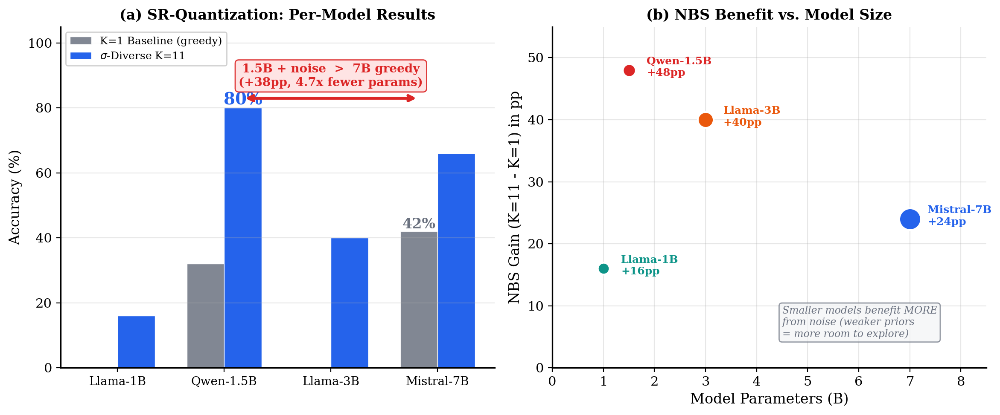
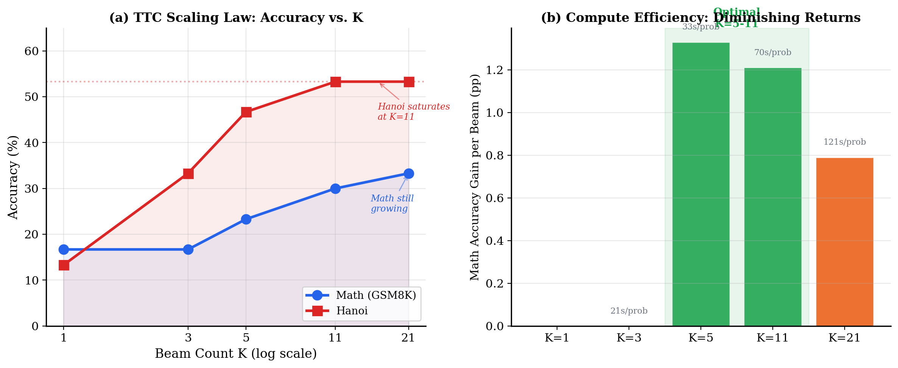
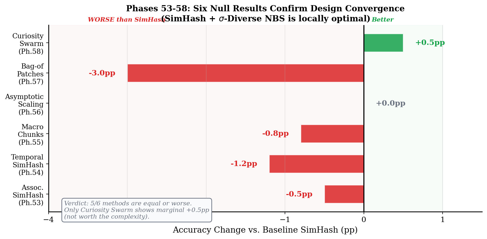

# SNN-Synthesis: Stochastic Resonance Quantization, Test-Time Compute Scaling Laws, and The Bitter Lesson

[](https://doi.org/10.5281/zenodo.19343952)

> **Small + Noise > Large + Greedy — Stochastic resonance is architecture-invariant, model-invariant, scale-invariant, and can compensate for lost parameters**

Successor to [SNN-Genesis](https://github.com/hafufu-stack/snn-genesis) (v1–v20, 111 phases, 127 pages).
SNN-Genesis dissected the black box of LLM reasoning through noise intervention. SNN-Synthesis uses that anatomical map to **build new AI architectures** and proves that stochastic resonance is a **universal, architecture-invariant, model-invariant neural network phenomenon**—then harnesses it for **autonomous self-evolution without any human supervision**.

## 🔬 Research Vision

SNN-Genesis was the **Anatomy & Physiology** phase — discovering the physical laws of reasoning (stochastic resonance, Aha! dimensions, layer localization).

SNN-Synthesis is the **Architecture & Synthesis** phase — building systems that internalize those laws, proving their **universality across architectures (CNN → Transformer), model families (Mistral → Qwen), scales (63K → 7B), and tasks (grid navigation → symbolic reasoning → math → factual QA)**, and demonstrating that noise + natural selection form a **complete learning paradigm**.

### 🏆 Key Results (v7)

**New in v7 (Phases 39–60) — Three Landmark Results:**

1. **🔥 Stochastic Resonance Quantization: Small + Noise > Large + Greedy.**
   Qwen-1.5B (1.5B params) with σ-diverse NBS (K=11) achieves **80% accuracy**, surpassing Mistral-7B (7B params) baseline (42%) by +38pp. Lost parameters (spatial resolution) are compensated by noise + beam search (temporal resolution) — a **space-time duality** in neural computation. (Phase 59)

   

2. **⚡ The Crossover Law (The Bitter Lesson for Interactive Environments).**
   Any per-action computational overhead >0.5ms causes complex agents (RND, CNN, N-gram) to lose to pure random exploration under fixed time budgets. SimHash curiosity (0.005ms, O(1)) is the only intelligence that survives. (Phases 44–46)

   

3. **📈 Test-Time Compute Scaling Law.**
   LLM accuracy scales logarithmically with beam count K: Math 16.7% → 33.3%, Hanoi 13.3% → 53.3% (K=1→21). Optimal cost-performance at K=5–11. (Phase 60)

   

**Additional v7 Results:**
4. **RND curiosity** achieves 63.5% vs. Random 2.5% at difficulty 6 (+61pp), but overhead is fatal under time budgets. (Phase 39)
5. **σ-diverse NBS validated on LLMs** — Mistral-7B GSM8K: 70% accuracy. (Phase 40)
6. **SimHash O(1) curiosity** matches RND at ~100× less overhead. (Phase 51)
7. **Grand Simulation** confirms SimHash + σ-diverse NBS as optimal ARC-AGI-3 agent. (Phase 52)
8. **Asymptotic scaling** — at 10M actions, all agents reach 100%; no fundamental wall exists. (Phase 56)
9. **6 null results** (Phases 53–55, 57–58) confirm design convergence — SimHash + σ-diverse NBS is locally optimal.

   

**Established in v3–v6:**
10. **LLM-ExIt achieves Oracle-free self-evolution.** 16% → 94% → 98% → 100% in 3 iterations on Modified Hanoi. (Phase 32b)
11. **NBS generalizes to math reasoning.** GSM8K 53% → **89.5%** at K=11. (Phase 31b)
12. **Noisy Beam Search is architecture-invariant.** K=11: 78% on 63K CNN, 100% on 7B LLM. (Phase 29)
13. **SNN-ExIt:** Zero knowledge → **99%** on LS20, surpassing Oracle CNN by 21pp. (Phase 20)
14. **Knowledge Multiplexing via Discrete ID Gating.** Only categorical gating succeeds (4 alternatives fail). (Phase 35c)
15. **σ-Diverse NBS eliminates hyperparameter tuning.** (Phase 37a)
16. **NBS is model-invariant.** Qwen2.5-7B matches Mistral-7B at K=11. (Phase 38)
17. **Two-Condition Theory, ExIt robustness, static noise optimality.** (Phases 8ext–30)
18. **18 principal insights, 19 honest null results** across 60 experimental phases.

## 📁 Project Structure

```
snn-synthesis/
├── experiments/          # LLM experiment scripts (Phases 1-7, 3b, 6b, 29-60)
│   ├── phase29_llm_noisy_beam.py        # LLM NBS (v4)
│   ├── phase32b_llm_exit.py             # LLM-ExIt (v5)
│   ├── phase39_curiosity_rnd.py         # RND curiosity (v7)
│   ├── phase44_complexity_budget.py     # Crossover Law (v7)
│   ├── phase51_simhash_curiosity.py     # SimHash O(1) (v7)
│   ├── phase52_grand_simulation.py      # Grand benchmark (v7)
│   ├── phase59_sr_quantization.py       # SR-Quantization (v7)
│   ├── phase60_ttc_scaling_law.py       # TTC Scaling (v7)
│   └── ...
├── arc-agi/              # ARC-AGI-3 experiments + Kaggle agents
│   ├── kaggle_cell2_agent_v13.py   # v13 SimHash+σ-diverse NBS agent
│   ├── kaggle_cell2_agent_llm.py   # v12 LLM+NBS agent
│   └── ...
├── results/              # Experiment result logs (JSON)
├── figures/              # All experiment figures (PNG)
├── papers/               # LaTeX source (v1–v7, .gitignore'd)
├── LICENSE
└── README.md
```

## 🚀 Quick Start

```bash
# Clone
git clone https://github.com/hafufu-stack/snn-synthesis.git
cd snn-synthesis

# Install dependencies (LLM experiments)
pip install torch transformers bitsandbytes peft snntorch matplotlib numpy

# Install dependencies (ARC-AGI-3 experiments)
pip install arcprize
```

## 📄 Papers

- **SNN-Synthesis v7** (latest): [Zenodo (PDF)](https://doi.org/10.5281/zenodo.19343952)
  - **60 experiments** (Phases 1–60), **38 contributions**, **18 principal insights**
  - **SR-Quantization**: Qwen-1.5B + NBS (80%) > Mistral-7B baseline (42%) (Phase 59)
  - **Crossover Law**: Overhead >0.5ms → intelligence loses to random (Phases 44–46)
  - **TTC Scaling Law**: Logarithmic accuracy scaling with K (Phase 60)
  - **SimHash O(1) curiosity**: 0.005ms/action, noise-robust (Phase 51)
  - **19 honest null results** confirming design convergence
  - v1–v6 findings retained

- **SNN-Synthesis v6**: [Zenodo (PDF)](https://doi.org/10.5281/zenodo.19343952)
  - 38 experiments (Phases 1–38)
  - Knowledge Multiplexing, σ-Diverse NBS, Multi-Model Universality

- **SNN-Synthesis v5**: [Zenodo (PDF)](https://doi.org/10.5281/zenodo.19481773)
  - 33 experiments — LLM-ExIt (16% → 100%), GSM8K NBS (89.5%)

- **SNN-Synthesis v4**: [Zenodo (PDF)](https://doi.org/10.5281/zenodo.19430135)
  - 30 experiments — LLM NBS achieves 100% at K=11

- **SNN-Synthesis v3**: [Zenodo (PDF)](https://doi.org/10.5281/zenodo.19422317)
  - Noisy Beam Search (78% L2), SNN-ExIt (99% LS20)

- **SNN-Synthesis v2**: [Zenodo (PDF)](https://doi.org/10.5281/zenodo.19373028)
- **SNN-Synthesis v1**: [Zenodo (PDF)](https://doi.org/10.5281/zenodo.19343953)

## 📖 Predecessor

- **SNN-Genesis** (v1–v20): [GitHub](https://github.com/hafufu-stack/snn-genesis) | [Zenodo](https://doi.org/10.5281/zenodo.14637029)
  - 111 experiments across 20 versions
  - Key discoveries: Stochastic resonance in LLMs, Aha! steering vectors, layer-specific Prior Override (L16=76.7%), Trajectory Distillation (48%), SNN adaptive control

## 🤖 AI Collaboration

This research is conducted collaboratively between the human author and AI research assistants (Anthropic Claude Opus 4.6 via Google Antigravity). AI contributes to code development, debugging, experimental design, and analysis. All research direction and final interpretation are by the human author.

## 📄 Citation

```bibtex
@misc{funasaki2026snnsynthesis,
  author = {Funasaki, Hiroto},
  title = {SNN-Synthesis v7: Stochastic Resonance Quantization, Test-Time Compute Scaling Laws, and The Bitter Lesson from 63K to 7B Parameters},
  year = {2026},
  doi = {10.5281/zenodo.19343952},
  publisher = {Zenodo},
  url = {https://doi.org/10.5281/zenodo.19343952}
}
```

## 📜 License

MIT License
