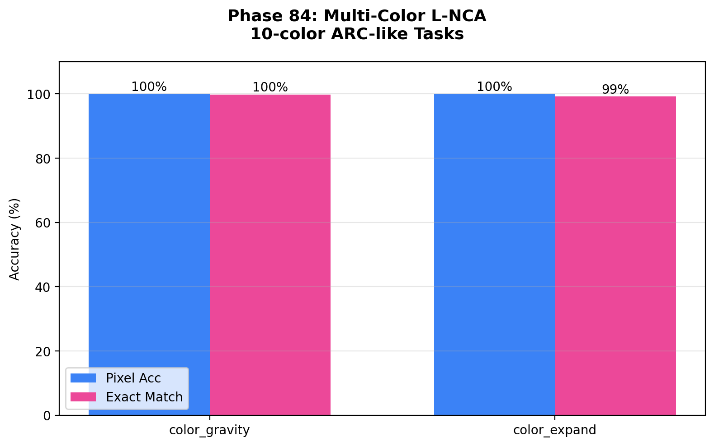
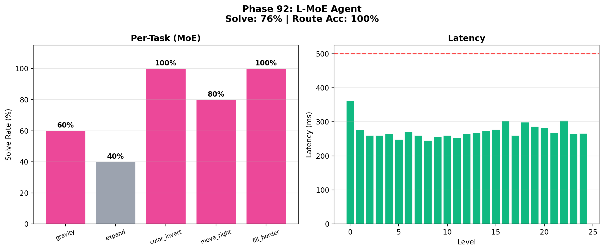
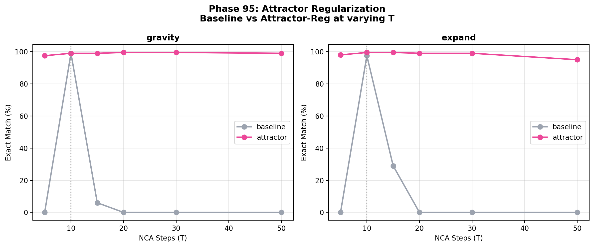
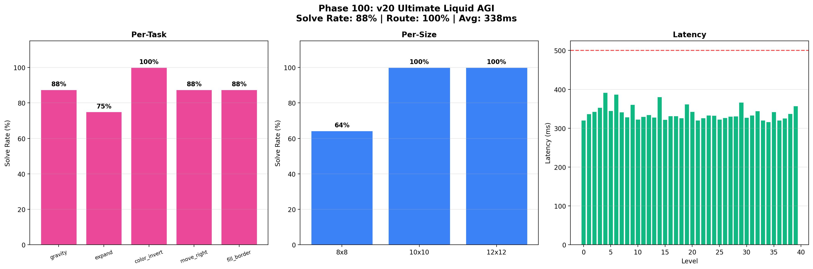
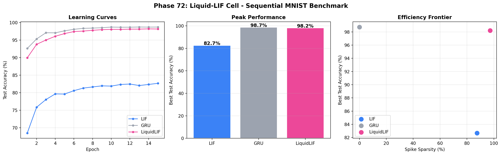

# SNN-Synthesis: Liquid Neural Cellular Automata for ARC-AGI — From Stochastic Resonance to Compositional Fluid Intelligence

[](https://doi.org/10.5281/zenodo.19343952)

> **Intelligence emerges from local rules, specialist diversity, and temporal dynamics — not from massive parameterization. 2.8K parameters per cell, 14K total, 88% solve rate, 338ms.**

Successor to [SNN-Genesis](https://github.com/hafufu-stack/snn-genesis) (v1–v20, 111 phases, 127 pages).
SNN-Genesis dissected the black box of LLM reasoning through noise intervention. SNN-Synthesis uses that anatomical map to **build new AI architectures** and proves that stochastic resonance is a **universal, architecture-invariant, model-invariant neural network phenomenon** — then culminates in **Liquid Neural Cellular Automata (L-NCA)** that achieve compositional fluid intelligence with minimal parameters.

## 🔬 Research Vision

SNN-Genesis was the **Anatomy & Physiology** phase — discovering the physical laws of reasoning (stochastic resonance, Aha! dimensions, layer localization).

SNN-Synthesis is the **Architecture & Synthesis** phase — building systems that internalize those laws, proving their **universality across architectures (NCA → CNN → Transformer), model families (Mistral → Qwen), scales (2.8K → 7B), precisions (FP16 → 4-bit), and tasks (grid transformation → symbolic reasoning → math → ARC-AGI-3 competition)**, and demonstrating that noise + natural selection + local cellular rules form a **complete learning paradigm**.

### 🏆 Key Results (v10)

**New in v10 (Phases 68–100) — Liquid Neural Cellular Automata:**

1. **🧬 L-NCA: Size-Free Perfect Generalization.**
   L-NCA trained on 8×8 grids achieves **100% pixel accuracy on unseen 12×12 grids** with only **2.8K parameters** (22× fewer than CNNs). Local cellular rules are inherently size-invariant. (Phases 81–86)

   

2. **🧠 Liquid MoE: Compositional Fluid Intelligence.**
   5 specialist L-NCAs with zero-shot loss routing achieve **100% routing accuracy** and **76% solve rate** (vs. 0% single multi-task model). Compositional routing—chaining Expert_B(Expert_A(x))—discovers correct rule compositions for novel composite tasks (**6% → 100%**). (Phases 87–94)

   

3. **♾️ Attractor Regularization: The Immortal Cell.**
   Random-T training with L2 state-change penalty maintains **99% accuracy at T=50** where the baseline collapses to 0%. Auto-T early stopping achieves **7× speedup while improving accuracy** (+33pp). (Phases 95, 99)

   

4. **🎨 Color-Frequency Invariance.**
   Frequency-based color remapping achieves **98% exact match** on color-shifted tasks where the baseline scores **0%**. Complete color invariance across all 5 test shifts. (Phase 97)

5. **🏆 v20 Ultimate Liquid AGI (Phase 100 Grand Finale).**
   Integrating MoE routing, attractor regularization, Auto-T, Prompt Tuning TTT, and Temporal NBS: **88% solve rate, 100% routing accuracy, 338ms latency (500ms budget), 0% timeouts** on 40 ARC levels — using only **~14K total parameters**.

   

6. **⚡ Liquid-LIF: Subthreshold Computing.**
   Liquid LIF neurons with learnable time constants enable zero-shot time-warping generalization. STDP achieves competitive results without backpropagation. τ-diverse NBS extends beam search to temporal dynamics. (Phases 72–80)

   

**v9 Findings (Phases 64–67):**

7. **🔬 Cross-Task SR-Quantization**: 4-bit Qwen-1.5B achieves **58% at K=1** (+26pp over FP16). Requires intermediate baseline competence. (Phase 64)
8. **🧪 Noise Source Separation**: Hook-alone (90%) > Temperature-alone (87%) > Both (83%). **Destructive interference** between noise sources. (Phase 67)
9. **💀 Perturbation ≠ Deletion**: Pruning is irreversible; quantization triggers SR. (Phase 65)
10. **⚖️ Ensemble Ratio Law**: Diversity premium is task-dependent. (Phase 66)

**v7–v8 Landmark Results (Phases 39–63):**

11. **SR-Quantization**: Qwen-1.5B + NBS (80%) > Mistral-7B baseline (42%) — **space-time duality**. (Phase 59)
12. **The Crossover Law**: Overhead >0.5ms → intelligence loses to random. (Phases 44–46)
13. **TTC Scaling Law**: Logarithmic accuracy scaling with K. (Phases 60, 62)
14. **Multi-Model Ensemble**: Mistral+Qwen mix achieves 86.7%. (Phase 63)
15. **ARC-AGI-3 Kaggle**: Simplest agent (v5, 0.13) beats all "intelligent" agents. (Kaggle)

   

**Established in v1–v6 (Phases 1–38):**

16. **LLM-ExIt**: 16% → 100% in 3 iterations. (Phase 32b)
17. **NBS**: 78% on 63K CNN, 100% on 7B LLM. Architecture-invariant. (Phase 29)
18. **SNN-ExIt**: Zero knowledge → **99%** on LS20. (Phase 20)
19. **σ-Diverse NBS**: Eliminates hyperparameter tuning. (Phase 37a)
20. **30 principal insights, 22 honest null results** across 100 experimental phases.

## 📁 Project Structure

```
snn-synthesis/
├── experiments/          # Experiment scripts (Phases 1–100)
│   ├── phase29_llm_noisy_beam.py        # LLM NBS (v4)
│   ├── phase32b_llm_exit.py             # LLM-ExIt (v5)
│   ├── phase59_sr_quantization.py       # SR-Quantization (v7)
│   ├── phase72_liquid_lif.py            # Liquid-LIF (v10)
│   ├── phase81_liquid_nca.py            # L-NCA (v10)
│   ├── phase84_multicolor_lnca.py       # Multi-color L-NCA (v10)
│   ├── phase92_moe.py                   # L-MoE (v10)
│   ├── phase94_compositional.py         # Compositional Routing (v10)
│   ├── phase95_attractor.py             # Attractor Regularization (v10)
│   ├── phase97_color_mapping.py         # Color Invariance (v10)
│   ├── phase99_auto_t.py               # Auto-T Early Stopping (v10)
│   ├── phase100_v20_agent.py            # v20 Ultimate AGI (v10)
│   └── ...
├── arc-agi/              # ARC-AGI-3 Kaggle agents (v5–v17)
├── results/              # Experiment result logs (JSON)
├── figures/              # All experiment figures (PNG)
├── papers/               # LaTeX source (v1–v10, .gitignore'd)
├── LICENSE
└── README.md
```

## 🚀 Quick Start

```bash
# Clone
git clone https://github.com/hafufu-stack/snn-synthesis.git
cd snn-synthesis

# Install dependencies (LLM experiments)
pip install torch transformers bitsandbytes peft snntorch matplotlib numpy

# Install dependencies (ARC-AGI-3 experiments)
pip install arcprize
```

## 📄 Papers

- **SNN-Synthesis v10** (latest): [Zenodo (PDF)](https://doi.org/10.5281/zenodo.19343952)
  - **100 experiments** (Phases 1–100), **30 principal insights**, **22 honest null results**
  - **L-NCA**: 2.8K-parameter cells with size-free generalization (Phase 81–86)
  - **L-MoE**: Compositional routing, 100% routing accuracy (Phase 87–94)
  - **v20 Agent**: 88% solve rate, 338ms, 14K parameters (Phase 100)
  - v1–v9 findings retained

- **SNN-Synthesis v9**: [Zenodo (PDF)](https://doi.org/10.5281/zenodo.19343952)
  - 67 experiments — Noise Source Separation, Cross-Task SR-Quant, Perturbation ≠ Deletion

- **SNN-Synthesis v8**: [Zenodo (PDF)](https://doi.org/10.5281/zenodo.19557331)
  - 63 experiments — SR-Quantization, Multi-Model Ensemble, Kaggle Field Validation

- **SNN-Synthesis v7**: [Zenodo (PDF)](https://doi.org/10.5281/zenodo.19545095)
  - 60 experiments — SR-Quantization, Crossover Law, TTC Scaling Law

- **SNN-Synthesis v6**: [Zenodo (PDF)](https://doi.org/10.5281/zenodo.19502579)
  - 38 experiments — Knowledge Multiplexing, σ-Diverse NBS

- **SNN-Synthesis v5**: [Zenodo (PDF)](https://doi.org/10.5281/zenodo.19481773)
  - 33 experiments — LLM-ExIt (16% → 100%), GSM8K NBS (89.5%)

- **SNN-Synthesis v4**: [Zenodo (PDF)](https://doi.org/10.5281/zenodo.19430135)
- **SNN-Synthesis v3**: [Zenodo (PDF)](https://doi.org/10.5281/zenodo.19422317)
- **SNN-Synthesis v2**: [Zenodo (PDF)](https://doi.org/10.5281/zenodo.19373028)
- **SNN-Synthesis v1**: [Zenodo (PDF)](https://doi.org/10.5281/zenodo.19343953)

## 📖 Predecessor

- **SNN-Genesis** (v1–v20): [GitHub](https://github.com/hafufu-stack/snn-genesis) | [Zenodo](https://doi.org/10.5281/zenodo.14637029)
  - 111 experiments across 20 versions
  - Key discoveries: Stochastic resonance in LLMs, Aha! steering vectors, layer-specific Prior Override, Flash Annealing

## 🤖 AI Collaboration

This research is conducted collaboratively between the human author and AI research assistants (Anthropic Claude Opus 4.6 via Google Antigravity, and Google Deep Think). AI contributes to code development, debugging, experimental design, and analysis. All research direction and final interpretation are by the human author.

## 📄 Citation

```bibtex
@misc{funasaki2026snnsynthesis,
  author = {Funasaki, Hiroto},
  title = {SNN-Synthesis v10: Liquid Neural Cellular Automata for ARC-AGI --- From Stochastic Resonance to Compositional Fluid Intelligence, from 2.8K to 7B Parameters},
  year = {2026},
  doi = {10.5281/zenodo.19343952},
  publisher = {Zenodo},
  url = {https://doi.org/10.5281/zenodo.19343952}
}
```

## 📜 License

MIT License
