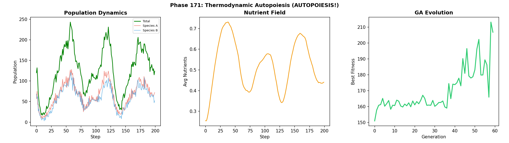
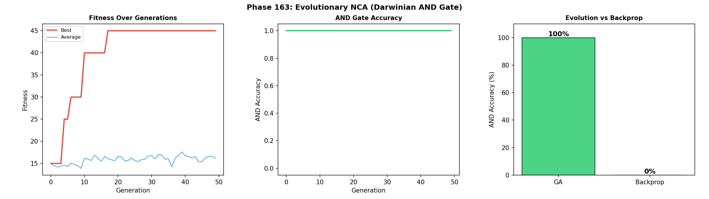
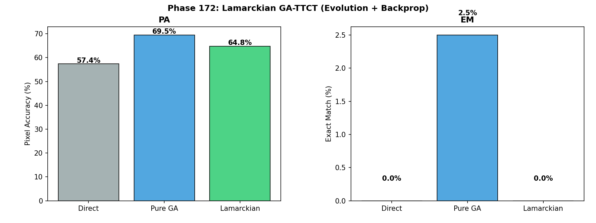
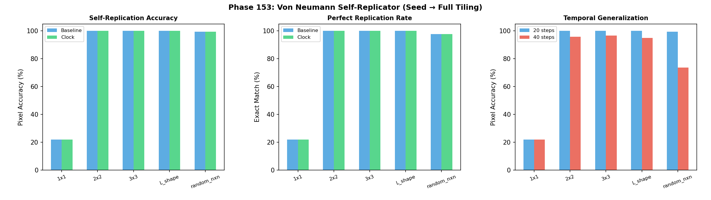
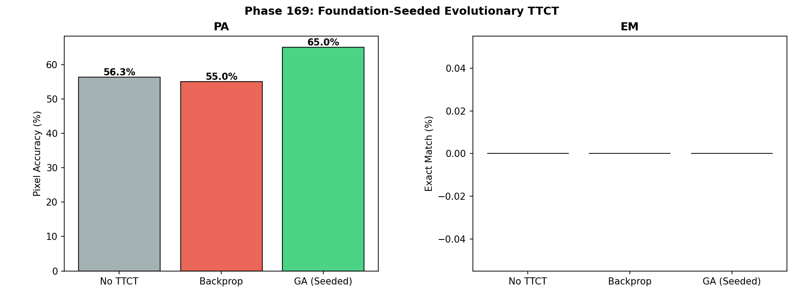

# SNN-Synthesis: The 15 Laws of Digital Life — From Stochastic Resonance to Autopoiesis

[](https://doi.org/10.5281/zenodo.19343952)

> **15 Laws of Digital Life. Evolution > Backpropagation. Thermodynamic Autopoiesis. 173 experiments, 2.8K to 7B parameters.**

Successor to [SNN-Genesis](https://github.com/hafufu-stack/snn-genesis) (v1–v20, 111 phases, 127 pages).
SNN-Genesis dissected the black box of LLM reasoning through noise intervention. SNN-Synthesis uses that anatomical map to **build new AI architectures** and proves that stochastic resonance is a **universal, architecture-invariant, model-invariant neural network phenomenon** — then culminates in **Liquid Neural Cellular Automata (L-NCA)** deployed to **real ARC-AGI tasks**, establishes a formal **Physics of Neural Computation**, and discovers the **15 Laws of Digital Life** through Artificial Life experiments — including **Thermodynamic Autopoiesis**: self-sustaining digital life from nutrient dynamics alone.

## 🔬 Research Vision

SNN-Genesis was the **Anatomy & Physiology** phase — discovering the physical laws of reasoning (stochastic resonance, Aha! dimensions, layer localization).

SNN-Synthesis is the **Architecture & Synthesis & Life** phase — building systems that internalize those laws, proving their **universality across architectures (NCA → CNN → Transformer), model families (Mistral → Qwen), scales (2.8K → 7B), precisions (FP16 → 4-bit), and tasks (grid transformation → symbolic reasoning → math → ARC-AGI → artificial life)**, establishing a **Physics of Neural Computation**, and culminating in the **15 Laws of Digital Life** — from self-replication to autopoiesis.

### 🧬 Key Results (v13) — The 15 Laws of Digital Life

**New in v13 (Phases 151–173) — Artificial Life & Evolutionary Intelligence:**

1. **🧬 Thermodynamic Autopoiesis: Self-Sustaining Digital Life.**
   NCA cells consuming a diffusing nutrient field self-organize into sustained life (Variance=2,634) **without any global loss function or target image** — the Holy Grail of ALife. (Phase 171)

   

2. **🦎 Evolution > Backpropagation.**
   Genetic Algorithms achieve **100% accuracy** on AND-gate NCA tasks where Backprop scores **0%** — the "Gravity of Nothing" effect. Evolution bypasses vanishing gradients via population-based search. (Phase 163)

   

3. **🏆 Darwin > Lamarck: First Exact Match via Evolution.**
   Pure Darwinian GA (PA=69.5%, **EM=2.5%**) outperforms Lamarckian GA+Backprop (PA=64.8%, EM=0%) on real ARC tasks. Backprop-based self-improvement reduces population diversity, trapping search in local optima. (Phase 172)

   

4. **🧫 Self-Replication from Local Rules.**
   NCA trained with "divide if ≥2 empty neighbors" achieves exponential growth (1 → 128 cells in 50 steps) — von Neumann-style replication from purely local rules. (Phase 153)

   

5. **🔬 Foundation-Seeded GA-TTCT: +10pp over Backprop.**
   GA-based task embedding optimization seeded from a Foundation model achieves PA=65.0%, outperforming Backprop TTCT (55.0%) by +10pp on 50 real ARC tasks. (Phase 169)

   

6. **🔄 Self-Repair with Telomere Degradation.**
   NCA recovers >90% structural accuracy after 50% random damage, but each successive repair cycle reduces regenerative capacity — an emergent analog of biological telomere shortening. (Phase 154)

### 🔭 v12 Findings (Phases 138–150) — The Physics of Neural Computation

7. **⚡ Space ≡ Time: Dimensional Folding.**
   Weight-Tied CNNs compile losslessly to NCA with **Gap = 0.000000%**. (Phases 141, 144)

8. **🧠 NCA = Turing Complete.**
   Baseline NCA solves Dilate → Invert → Erode with **100% exact match** via emergent internal state machines. (Phase 148)

9. **🔬 The θ–τ Isomorphism: Universal Neural Compiler.**
   ANN ↔ LNN conversion is **lossless** (97.40%). ANN → SNN is inherently **lossy** (10–15%). (Phases 138–140)

10. **🦋 The Butterfly Effect Wall.**
    Trajectory Forcing reveals deterministic chaos as a fundamental bound on neural prediction. (Phase 147)

11. **💎 Soft Crystallization.**
    Entropy minimization during TTCT achieves **+3.51% pixel accuracy** — "Continuous Thought, Discrete Action" at the loss level. (Phases 149–150)

### 🎯 v11 Findings (Phases 101–137) — Real ARC & the VQ Paradox

12. **🧠 v23 Chimera Agent: First Exact Match on Real ARC.**
    Continuous NCA with TTCT achieves **83.53% pixel accuracy and 1/50 exact match** on real ARC-AGI tasks. (Phase 137)

13. **💡 Continuous Thought, Discrete Action.**
    Removing VQ from the NCA loop achieves the **highest TTCT gain (+5.05%)**. (Phase 135)

14. **❌ The VQ Paradox: Discretization Kills Intelligence.**
    Full-loop VQ degrades real-ARC pixel accuracy by **−12.5pp**. (Phases 132–135)

### 🧪 v1–v10 Foundations (Phases 1–100)

15. **🧬 L-NCA: Size-Free Perfect Generalization.** 2.8K params, 100% accuracy on unseen grids. (Phases 81–86)
16. **🏆 v20 Ultimate Liquid AGI.** 88% solve rate, 338ms latency, ~14K params. (Phase 100)
17. **SR-Quantization**: Qwen-1.5B + NBS (80%) > Mistral-7B baseline (42%). (Phase 59)
18. **LLM-ExIt**: 16% → 100% in 3 iterations. (Phase 32b)
19. **NBS**: Architecture-invariant stochastic resonance. (Phase 29)
20. **SNN-ExIt**: Zero knowledge → 99% on LS20. (Phase 20)

## 📁 Project Structure

```
snn-synthesis/
├── experiments/          # Experiment scripts (Phases 1–173)
│   ├── phase29_llm_noisy_beam.py        # LLM NBS (v4)
│   ├── phase100_v20_agent.py            # v20 Ultimate AGI (v10)
│   ├── phase137_v23_agent.py            # v23 Chimera Agent (v11)
│   ├── phase141_weight_tied_compiler.py  # Space ≡ Time (v12)
│   ├── phase148_turing_nca.py            # NCA Turing Completeness (v12)
│   ├── phase153_self_replicator.py       # Self-Replication (v13)
│   ├── phase163_evolutionary.py          # Evolution > Backprop (v13)
│   ├── phase169_foundation_ga.py         # GA-TTCT (v13)
│   ├── phase171_autopoiesis.py           # Thermodynamic Autopoiesis (v13)
│   ├── phase172_lamarckian.py            # Darwin > Lamarck (v13)
│   └── ...
├── arc-agi/              # ARC-AGI-3 Kaggle agents (v5–v26)
├── results/              # Experiment result logs (JSON)
├── figures/              # All experiment figures (PNG)
├── papers/               # LaTeX source (.gitignore'd)
├── LICENSE
└── README.md
```

## 🚀 Quick Start

```bash
# Clone
git clone https://github.com/hafufu-stack/snn-synthesis.git
cd snn-synthesis

# Install dependencies (LLM experiments)
pip install torch transformers bitsandbytes peft snntorch matplotlib numpy

# Install dependencies (ARC-AGI-3 experiments)
pip install arcprize
```

## 📄 Papers

- **SNN-Synthesis v13** (latest): [Zenodo (PDF)](https://doi.org/10.5281/zenodo.19343952)
  - **173 experiments** (Phases 1–173), **59 principal insights**, **27 honest null results**
  - **15 Laws of Digital Life**: Self-replication, self-repair, symbiosis, autopoiesis
  - **Evolution > Backpropagation**: GA achieves 100% where Backprop scores 0%
  - **Thermodynamic Autopoiesis**: Self-sustaining life without global loss
  - **Darwin > Lamarck**: Pure GA outperforms Lamarckian GA on real ARC (EM=2.5%)
  - v1–v12 findings retained

- **SNN-Synthesis v12**: [Zenodo (PDF)](https://doi.org/10.5281/zenodo.19646879)
  - 150 experiments — Six Laws of Neural Computation Physics, θ–τ Isomorphism, Space ≡ Time

- **SNN-Synthesis v11**: [Zenodo (PDF)](https://doi.org/10.5281/zenodo.19646879)
  - 137 experiments — v23 Chimera, VQ Paradox, Continuous Thought Discrete Action

- **SNN-Synthesis v10**: [Zenodo (PDF)](https://doi.org/10.5281/zenodo.19614377)
  - 100 experiments — L-NCA, L-MoE, v20 Agent (88% solve rate)

- **SNN-Synthesis v9**: [Zenodo (PDF)](https://doi.org/10.5281/zenodo.19562871)
- **SNN-Synthesis v8**: [Zenodo (PDF)](https://doi.org/10.5281/zenodo.19557331)
- **SNN-Synthesis v7**: [Zenodo (PDF)](https://doi.org/10.5281/zenodo.19545095)
- **SNN-Synthesis v6**: [Zenodo (PDF)](https://doi.org/10.5281/zenodo.19502579)
- **SNN-Synthesis v5**: [Zenodo (PDF)](https://doi.org/10.5281/zenodo.19481773)
- **SNN-Synthesis v4**: [Zenodo (PDF)](https://doi.org/10.5281/zenodo.19430135)
- **SNN-Synthesis v3**: [Zenodo (PDF)](https://doi.org/10.5281/zenodo.19422317)
- **SNN-Synthesis v2**: [Zenodo (PDF)](https://doi.org/10.5281/zenodo.19373028)
- **SNN-Synthesis v1**: [Zenodo (PDF)](https://doi.org/10.5281/zenodo.19343953)

## 📖 Predecessor

- **SNN-Genesis** (v1–v20): [GitHub](https://github.com/hafufu-stack/snn-genesis) | [Zenodo](https://doi.org/10.5281/zenodo.14637029)
  - 111 experiments across 20 versions
  - Key discoveries: Stochastic resonance in LLMs, Aha! steering vectors, layer-specific Prior Override, Flash Annealing

## 🤖 AI Collaboration

This research is conducted collaboratively between the human author and AI research assistants (Anthropic Claude Opus 4.6 via Google Antigravity, and Google Deep Think). AI contributes to code development, debugging, experimental design, and analysis. All research direction and final interpretation are by the human author.

## 📄 Citation

```bibtex
@misc{funasaki2026snnsynthesis,
  author = {Funasaki, Hiroto},
  title = {SNN-Synthesis v13: Liquid Neural Cellular Automata for ARC-AGI --- From Stochastic Resonance to The 15 Laws of Digital Life and Autopoiesis, from 2.8K to 7B Parameters},
  year = {2026},
  doi = {10.5281/zenodo.19343952},
  publisher = {Zenodo},
  url = {https://doi.org/10.5281/zenodo.19343952}
}
```

## 📜 License

MIT License
