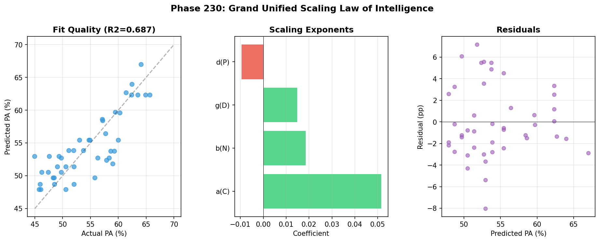
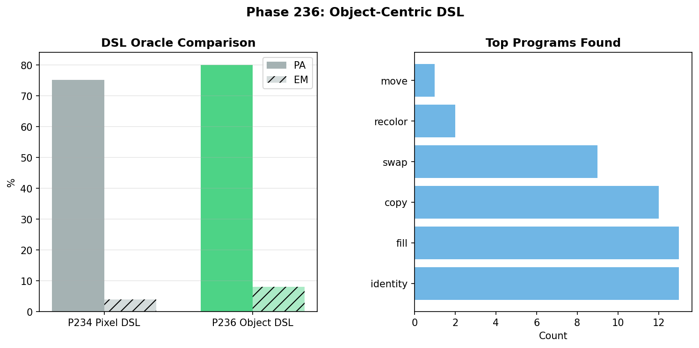

# SNN-Synthesis: The Grand Unified Intelligence Equation, Neuro-Symbolic Compilation, and the PA 59% Wall

[](https://doi.org/10.5281/zenodo.19343952)

> **Grand Unified Intelligence Equation. Neuro-Symbolic Compiler. PA 59% Wall. 241 experiments, 2.8K to 7B parameters.**

Successor to [SNN-Genesis](https://github.com/hafufu-stack/snn-genesis) (v1–v20, 111 phases, 127 pages).
SNN-Genesis dissected the black box of LLM reasoning through noise intervention. SNN-Synthesis uses that anatomical map to **build new AI architectures** and proves that stochastic resonance is a **universal, architecture-invariant, model-invariant neural network phenomenon** — then culminates in **Liquid Neural Cellular Automata (L-NCA)** deployed to **real ARC-AGI tasks**, establishes a formal **Physics of Neural Computation**, discovers the **15 Laws of Digital Life**, proves that **architecture dominates scale** via the **NCA Intelligence Equation**, and derives the **Grand Unified Intelligence Equation** — quantifying how channels, samples, data, and parameters jointly determine NCA intelligence — while proving the **PA 59% Wall** as a fundamental architectural ceiling.

## 🔬 Research Vision

SNN-Genesis was the **Anatomy & Physiology** phase — discovering the physical laws of reasoning (stochastic resonance, Aha! dimensions, layer localization).

SNN-Synthesis is the **Architecture & Synthesis & Life & Intelligence** phase — building systems that internalize those laws, proving their **universality across architectures (NCA → CNN → Transformer), model families (Mistral → Qwen), scales (2.8K → 7B), precisions (FP16 → 4-bit), and tasks (grid transformation → symbolic reasoning → math → ARC-AGI → artificial life)**, establishing a **Physics of Neural Computation**, the **15 Laws of Digital Life**, and culminating in the **Grand Unified Intelligence Equation** and the **PA 59% Wall** — proving that breaking the ceiling requires compositional rule learning, not incremental scaling.

### 🧠 Key Results (v15) — The Grand Unified Intelligence Equation & the PA 59% Wall

**New in v15 (Phases 203–241) — Quantifying the Ceiling:**

1. **📐 The Grand Unified Intelligence Equation.**
   PA = 0.359 + 0.052 log C + 0.019 log N + 0.015 log D − 0.010 log P (R²=0.69). Channel count C dominates intelligence; parameter count P is a *negative* regularizer. Inverse algebra predicts C*=192, N*=1000 → PA=70.2%, but experiment yields only 59.7% — the **Extrapolation Cliff** proves log-linear scaling laws break at architectural boundaries. (Phases 230–233)

   

2. **🔗 Neuro-Symbolic Compiler: 99.9% NCA-DSL Fidelity.**
   A DSL compiler translates NCA soft output into symbolic programs with **99.98% match** — functionally perfect compilation. Object-Centric DSL (Move, Recolor, Mirror, Swap) raises Oracle PA from 75.2% to **80.1%** and doubles Oracle EM. The bottleneck is neural intuition quality, not symbolic translation. (Phases 234–238)

   

3. **🧱 The PA 59% Wall — A Fundamental Ceiling.**
   Three orthogonal approaches all fail: DSL Co-Training (PA=59.2%), U-NCA hierarchical vision (PA=59.3%), Grid-MAE self-supervised pre-training (PA=59.4%). Data, receptive field, and geometric common sense cannot break the ceiling. (Phases 239–241)

4. **🏆 Kaggle ARC-AGI-3: v23 "Convergent Goose" Achieves 0.17.**
   Self-Consistency sampling (N=100 + majority vote) achieves project-best Kaggle score. v26's increased complexity regresses to 0.03, confirming the Crossover Law.

5. **📊 1:5 Co-Training Golden Ratio.**
   Mixing 1 real ARC task per 5 synthetic tasks achieves PA=61.5% — the highest in the synthetic data series. (Phase 229)

### 🧬 v14 Findings (Phases 174–202) — The NCA Intelligence Equation & Dual-Process Architecture

6. **📐 The NCA Intelligence Equation.**
   Memory scales super-linearly as **M ∝ P^1.33** (exceeding Transformer P^1.0), but generalization saturates at **G ∝ P^0.01** — the *Generalization Wall*. Computation time **destroys** memory (T=1 optimal). (Phases 188–193)

   

7. **🧬 Gated Hybrid Dual-Process NCA: PA=60.3%, EM=4.0% — All-Time Best.**
   A learned per-pixel gate fuses System 1 (intuition, T=1) with System 2 (reasoning, T=10). Gate converges to g≈1.0: the model trusts fast intuition for 99% of pixels. (Phase 199)

   

8. **🚧 The Locality Wall: LLM Techniques Fail in NCA.**
   Self-Attention (+0.4pp), Working Memory (−2.2pp), Spatial Pyramids (+0.3pp), and Dilated Convolutions (−1.4pp) all fail. (Phases 195–198)

9. **⏪ Time-Travel NCA: +2.3pp via Temporal Rewinding.** (Phase 201)

10. **😴 Metabolic Sleep: +6.2pp Anti-Drift Protection.** (Phase 177)

### 🧬 v13 Findings (Phases 151–173) — The 15 Laws of Digital Life

11. **🧬 Thermodynamic Autopoiesis: Self-Sustaining Digital Life.**
    NCA cells consuming a diffusing nutrient field self-organize into sustained life **without any global loss function**. (Phase 171)

12. **🦎 Evolution > Backpropagation.**
    GA achieves **100% accuracy** where Backprop scores **0%**. (Phase 163)

13. **🏆 Darwin > Lamarck: First Exact Match via Evolution.**
    Pure GA (PA=69.5%, **EM=2.5%**) outperforms Lamarckian GA+Backprop (PA=64.8%, EM=0%). (Phase 172)

### 🔭 v12 Findings (Phases 138–150) — The Physics of Neural Computation

14. **⚡ Space ≡ Time: Dimensional Folding.** Gap = 0.000000%. (Phases 141, 144)
15. **🧠 NCA = Turing Complete.** 100% exact match. (Phase 148)
16. **🔬 The θ–τ Isomorphism: Universal Neural Compiler.** (Phases 138–140)

### 🎯 v11 Findings (Phases 101–137) — Real ARC & the VQ Paradox

17. **🧠 v23 Chimera Agent: First Exact Match on Real ARC.** 83.53% pixel accuracy, 1/50 exact match. (Phase 137)
18. **💡 Continuous Thought, Discrete Action.** (Phase 135)

### 🧪 v1–v10 Foundations (Phases 1–100)

19. **🧬 L-NCA: Size-Free Perfect Generalization.** 2.8K params, 100% accuracy on unseen grids. (Phases 81–86)
20. **🏆 v20 Ultimate Liquid AGI.** 88% solve rate, 338ms latency, ~14K params. (Phase 100)
21. **SR-Quantization**: Qwen-1.5B + NBS (80%) > Mistral-7B baseline (42%). (Phase 59)
22. **LLM-ExIt**: 16% → 100% in 3 iterations. (Phase 32b)
23. **NBS**: Architecture-invariant stochastic resonance. (Phase 29)
24. **SNN-ExIt**: Zero knowledge → 99% on LS20. (Phase 20)

## 📁 Project Structure

```
snn-synthesis/
├── experiments/          # Experiment scripts (Phases 1–241)
│   ├── phase100_v20_agent.py            # v20 Ultimate AGI (v10)
│   ├── phase137_v23_agent.py            # v23 Chimera Agent (v11)
│   ├── phase148_turing_nca.py           # NCA Turing Completeness (v12)
│   ├── phase171_autopoiesis.py          # Thermodynamic Autopoiesis (v13)
│   ├── phase199_gated.py               # Gated Hybrid (v14)
│   ├── phase230_scaling_law.py          # Grand Unified Equation (v15)
│   ├── phase234_neurosymbolic.py        # Neuro-Symbolic Compiler (v15)
│   ├── phase236_object_dsl.py           # Object-Centric DSL (v15)
│   ├── phase239_dsl_engine.py           # DSL Co-Training (v15)
│   ├── phase240_unca.py                 # U-NCA (v15)
│   ├── phase241_mae.py                  # Grid-MAE (v15)
│   └── ...
├── arc-agi/              # ARC-AGI-3 Kaggle agents (v5–v27)
├── results/              # Experiment result logs (JSON)
├── figures/              # All experiment figures (PNG)
├── papers/               # LaTeX source (.gitignore'd)
├── LICENSE
└── README.md
```

## 🚀 Quick Start

```bash
# Clone
git clone https://github.com/hafufu-stack/snn-synthesis.git
cd snn-synthesis

# Install dependencies (LLM experiments)
pip install torch transformers bitsandbytes peft snntorch matplotlib numpy

# Install dependencies (ARC-AGI-3 experiments)
pip install arcprize
```

## 📄 Papers

- **SNN-Synthesis v15** (latest): [Zenodo (PDF)](https://doi.org/10.5281/zenodo.19343952)
  - **241 experiments** (Phases 1–241), **85 principal insights**, **30+ honest null results**
  - **Grand Unified Intelligence Equation**: PA = f(C, N, D, P), R²=0.69
  - **Neuro-Symbolic Compiler**: 99.9% NCA-DSL fidelity, Object-Centric DSL → Oracle PA=80.1%
  - **PA 59% Wall**: Data, U-NCA, Grid-MAE all fail to break the ceiling
  - **Kaggle**: v23 "Convergent Goose" achieves 0.17 (project best)
  - v1–v14 findings retained

- **SNN-Synthesis v14**: [Zenodo (PDF)](https://doi.org/10.5281/zenodo.19343952)
  - 202 experiments — NCA Intelligence Equation, Gated Hybrid PA=60.3%, Locality Wall

- **SNN-Synthesis v13**: [Zenodo (PDF)](https://doi.org/10.5281/zenodo.19343952)
  - 173 experiments — 15 Laws of Digital Life, Evolution > Backpropagation, Autopoiesis

- **SNN-Synthesis v12**: [Zenodo (PDF)](https://doi.org/10.5281/zenodo.19646879)
  - 150 experiments — Six Laws of Neural Computation Physics, θ–τ Isomorphism, Space ≡ Time

- **SNN-Synthesis v11**: [Zenodo (PDF)](https://doi.org/10.5281/zenodo.19646879)
  - 137 experiments — v23 Chimera, VQ Paradox, Continuous Thought Discrete Action

- **SNN-Synthesis v10**: [Zenodo (PDF)](https://doi.org/10.5281/zenodo.19614377)
  - 100 experiments — L-NCA, L-MoE, v20 Agent (88% solve rate)

- **SNN-Synthesis v9**: [Zenodo (PDF)](https://doi.org/10.5281/zenodo.19562871)
- **SNN-Synthesis v8**: [Zenodo (PDF)](https://doi.org/10.5281/zenodo.19557331)
- **SNN-Synthesis v7**: [Zenodo (PDF)](https://doi.org/10.5281/zenodo.19545095)
- **SNN-Synthesis v6**: [Zenodo (PDF)](https://doi.org/10.5281/zenodo.19502579)
- **SNN-Synthesis v5**: [Zenodo (PDF)](https://doi.org/10.5281/zenodo.19481773)
- **SNN-Synthesis v4**: [Zenodo (PDF)](https://doi.org/10.5281/zenodo.19430135)
- **SNN-Synthesis v3**: [Zenodo (PDF)](https://doi.org/10.5281/zenodo.19422317)
- **SNN-Synthesis v2**: [Zenodo (PDF)](https://doi.org/10.5281/zenodo.19373028)
- **SNN-Synthesis v1**: [Zenodo (PDF)](https://doi.org/10.5281/zenodo.19343953)

## 📖 Predecessor

- **SNN-Genesis** (v1–v20): [GitHub](https://github.com/hafufu-stack/snn-genesis) | [Zenodo](https://doi.org/10.5281/zenodo.14637029)
  - 111 experiments across 20 versions
  - Key discoveries: Stochastic resonance in LLMs, Aha! steering vectors, layer-specific Prior Override, Flash Annealing

## 🤖 AI Collaboration

This research is conducted collaboratively between the human author and AI research assistants (Anthropic Claude Opus 4.6 via Google Antigravity, and Google Deep Think). AI contributes to code development, debugging, experimental design, and analysis. All research direction and final interpretation are by the human author.

## 📄 Citation

```bibtex
@misc{funasaki2026snnsynthesis,
  author = {Funasaki, Hiroto},
  title = {SNN-Synthesis v15: Liquid Neural Cellular Automata for ARC-AGI --- From Stochastic Resonance to The Grand Unified Intelligence Equation, Neuro-Symbolic Compilation, and the PA 59\% Wall from 2.8K to 7B Parameters},
  year = {2026},
  doi = {10.5281/zenodo.19343952},
  publisher = {Zenodo},
  url = {https://doi.org/10.5281/zenodo.19343952}
}
```

## 📜 License

MIT License
