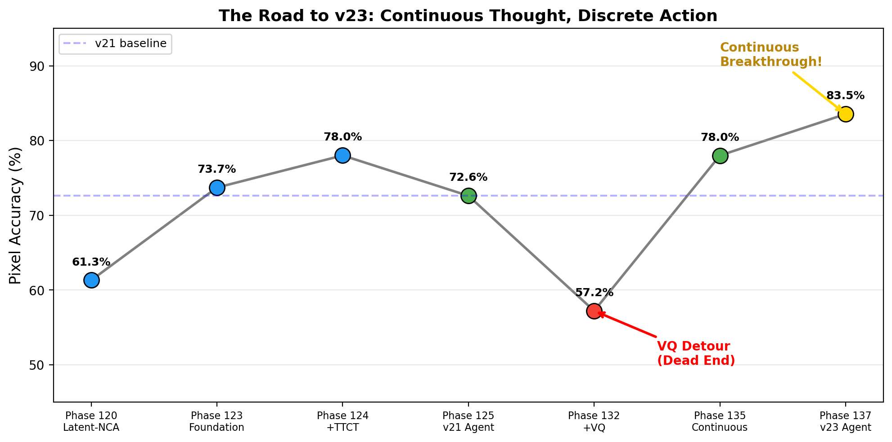
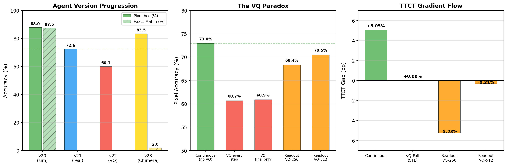
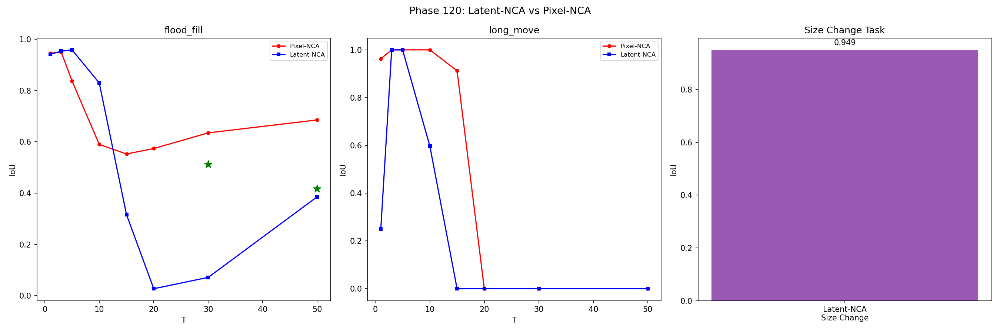
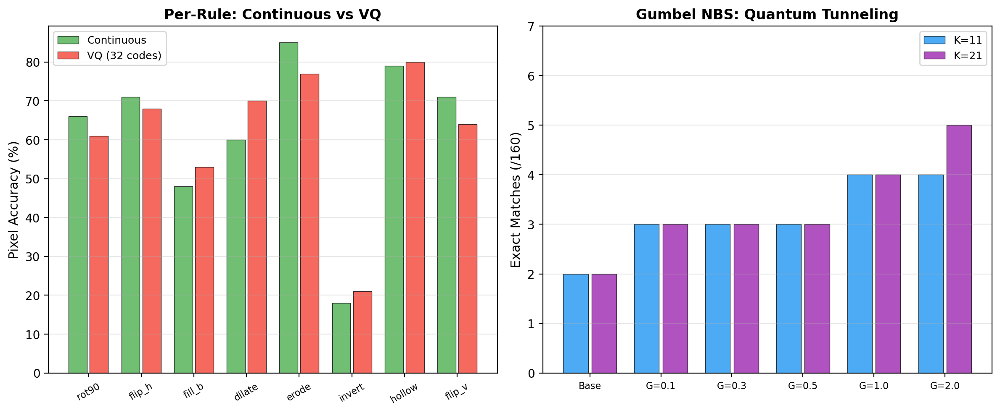
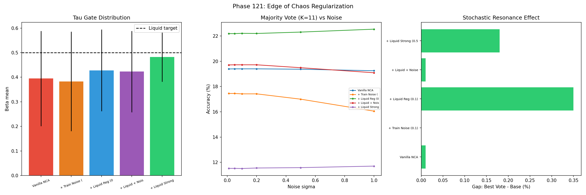

# SNN-Synthesis: Liquid Neural Cellular Automata for ARC-AGI — Continuous Thought, Discrete Action

[](https://doi.org/10.5281/zenodo.19343952)

> **Intelligence requires continuous, differentiable thought with discrete output crystallization. 2.8K parameters per cell, 83.5% pixel accuracy, first exact match on real ARC.**

Successor to [SNN-Genesis](https://github.com/hafufu-stack/snn-genesis) (v1–v20, 111 phases, 127 pages).
SNN-Genesis dissected the black box of LLM reasoning through noise intervention. SNN-Synthesis uses that anatomical map to **build new AI architectures** and proves that stochastic resonance is a **universal, architecture-invariant, model-invariant neural network phenomenon** — then culminates in **Liquid Neural Cellular Automata (L-NCA)** deployed to **real ARC-AGI tasks**, establishing the principle of **Continuous Thought, Discrete Action**.

## 🔬 Research Vision

SNN-Genesis was the **Anatomy & Physiology** phase — discovering the physical laws of reasoning (stochastic resonance, Aha! dimensions, layer localization).

SNN-Synthesis is the **Architecture & Synthesis** phase — building systems that internalize those laws, proving their **universality across architectures (NCA → CNN → Transformer), model families (Mistral → Qwen), scales (2.8K → 7B), precisions (FP16 → 4-bit), and tasks (grid transformation → symbolic reasoning → math → ARC-AGI-3 competition)**, and demonstrating that noise + natural selection + local cellular rules form a **complete learning paradigm**.

### 🏆 Key Results (v11)

**New in v11 (Phases 101–137) — Real ARC Deployment & the VQ Paradox:**

1. **🧠 v23 Chimera Agent: First Exact Match on Real ARC.**
   Continuous NCA with TTCT achieves **83.53% pixel accuracy and 1/50 exact match** on real ARC-AGI tasks — the first time any L-NCA system has produced a pixel-perfect solution on an unseen real task. +10.93pp over v21. (Phase 137)

   

2. **💡 Continuous Thought, Discrete Action.**
   Removing VQ from the NCA loop and using continuous computation with TTCT achieves the **highest TTCT gain (+5.05%)**. Intelligence requires continuous, differentiable thought with discrete output crystallization. (Phase 135)

   

3. **❌ The VQ Paradox: Discretization Kills Intelligence.**
   Full-loop VQ degrades real-ARC pixel accuracy by **−12.5pp** (72.6% → 60.1%) and kills TTCT gradient flow (gap = +0.00%). Even Readout-Only VQ degrades adaptation. The most important null result of v11. (Phases 132–135)

4. **🔬 Latent-NCA Breakthrough.**
   Operating NCA dynamics in a learned latent space achieves **22.7× improvement** in IoU (0.027 → 0.613), enabling real ARC reasoning for the first time. (Phase 120)

   

5. **📐 Context-NCA with TTCT.**
   In-context meta-learning with gradient-based Test-Time Context Tuning achieves **78.0% pixel accuracy** on 73 held-out real ARC tasks. (Phases 122–124)

6. **🎯 VQ-NCA: First Exact Match (Toy Tasks).**
   VQ-NCA achieves 1.9% exact match (3/160) on 8-rule tasks. Gumbel NBS boosts this by +150% via discrete attractor tunneling. (Phases 128, 130)

   

7. **🔄 Edge of Chaos.**
   Well-trained L-NCAs operate at **λ_max ≈ 0**, the critical boundary between stable and chaotic dynamics. (Phase 121)

   

8. **38 principal insights, 27 honest null results** across 137 experimental phases.

**v10 Findings (Phases 68–100) — Liquid NCA:**

9. **🧬 L-NCA: Size-Free Perfect Generalization.**
   L-NCA trained on 8×8 grids achieves **100% pixel accuracy on unseen 12×12 grids** with only **2.8K parameters** (22× fewer than CNNs). (Phases 81–86)

10. **🧠 Liquid MoE: Compositional Fluid Intelligence.**
    5 specialist L-NCAs with zero-shot loss routing: **100% routing accuracy**, **76% solve rate**. Compositional routing: **6% → 100%**. (Phases 87–94)

11. **🏆 v20 Ultimate Liquid AGI.**
    **88% solve rate, 100% routing accuracy, 338ms latency, 0% timeouts** on 40 ARC levels — **~14K total parameters**. (Phase 100)

    

**v7–v9 Findings (Phases 39–67):**

12. **SR-Quantization**: Qwen-1.5B + NBS (80%) > Mistral-7B baseline (42%) — **space-time duality**. (Phase 59)
13. **The Crossover Law**: Overhead >0.5ms → intelligence loses to random. (Phases 44–46)
14. **TTC Scaling Law**: Logarithmic accuracy scaling with K. (Phases 60, 62)
15. **Multi-Model Ensemble**: Mistral+Qwen mix achieves 86.7%. (Phase 63)
16. **Noise Source Separation**: Hook-alone (90%) > Temperature-alone (87%) > Both (83%). (Phase 67)

**Established in v1–v6 (Phases 1–38):**

17. **LLM-ExIt**: 16% → 100% in 3 iterations. (Phase 32b)
18. **NBS**: 78% on 63K CNN, 100% on 7B LLM. Architecture-invariant. (Phase 29)
19. **SNN-ExIt**: Zero knowledge → **99%** on LS20. (Phase 20)
20. **σ-Diverse NBS**: Eliminates hyperparameter tuning. (Phase 37a)

## 📁 Project Structure

```
snn-synthesis/
├── experiments/          # Experiment scripts (Phases 1–137)
│   ├── phase29_llm_noisy_beam.py        # LLM NBS (v4)
│   ├── phase32b_llm_exit.py             # LLM-ExIt (v5)
│   ├── phase59_sr_quantization.py       # SR-Quantization (v7)
│   ├── phase81_liquid_nca.py            # L-NCA (v10)
│   ├── phase92_moe.py                   # L-MoE (v10)
│   ├── phase100_v20_agent.py            # v20 Ultimate AGI (v10)
│   ├── phase120_latent_nca.py           # Latent-NCA (v11)
│   ├── phase124_ttct.py                 # TTCT (v11)
│   ├── phase128_vq_nca.py              # VQ-NCA (v11)
│   ├── phase135_readout_vq.py           # Readout-Only VQ (v11)
│   ├── phase137_v23_agent.py            # v23 Chimera Agent (v11)
│   └── ...
├── arc-agi/              # ARC-AGI-3 Kaggle agents (v5–v23)
├── results/              # Experiment result logs (JSON)
├── figures/              # All experiment figures (PNG)
├── papers/               # LaTeX source (v1–v11, .gitignore'd)
├── LICENSE
└── README.md
```

## 🚀 Quick Start

```bash
# Clone
git clone https://github.com/hafufu-stack/snn-synthesis.git
cd snn-synthesis

# Install dependencies (LLM experiments)
pip install torch transformers bitsandbytes peft snntorch matplotlib numpy

# Install dependencies (ARC-AGI-3 experiments)
pip install arcprize
```

## 📄 Papers

- **SNN-Synthesis v11** (latest): [Zenodo (PDF)](https://doi.org/10.5281/zenodo.19343952)
  - **137 experiments** (Phases 1–137), **38 principal insights**, **27 honest null results**
  - **v23 Chimera Agent**: 83.5% pixel accuracy, first exact match on real ARC (Phase 137)
  - **VQ Paradox**: Discretization kills intelligence on complex tasks (Phases 132–135)
  - **Continuous Thought, Discrete Action**: The optimal NCA paradigm (Phase 135)
  - v1–v10 findings retained

- **SNN-Synthesis v10**: [Zenodo (PDF)](https://doi.org/10.5281/zenodo.19614377)
  - 100 experiments — L-NCA, L-MoE, Attractor Regularization, v20 Agent (88% solve rate)

- **SNN-Synthesis v9**: [Zenodo (PDF)](https://doi.org/10.5281/zenodo.19562871)
  - 67 experiments — Noise Source Separation, Cross-Task SR-Quant, Perturbation ≠ Deletion

- **SNN-Synthesis v8**: [Zenodo (PDF)](https://doi.org/10.5281/zenodo.19557331)
  - 63 experiments — SR-Quantization, Multi-Model Ensemble, Kaggle Field Validation

- **SNN-Synthesis v7**: [Zenodo (PDF)](https://doi.org/10.5281/zenodo.19545095)
  - 60 experiments — SR-Quantization, Crossover Law, TTC Scaling Law

- **SNN-Synthesis v6**: [Zenodo (PDF)](https://doi.org/10.5281/zenodo.19502579)
  - 38 experiments — Knowledge Multiplexing, σ-Diverse NBS

- **SNN-Synthesis v5**: [Zenodo (PDF)](https://doi.org/10.5281/zenodo.19481773)
  - 33 experiments — LLM-ExIt (16% → 100%), GSM8K NBS (89.5%)

- **SNN-Synthesis v4**: [Zenodo (PDF)](https://doi.org/10.5281/zenodo.19430135)
- **SNN-Synthesis v3**: [Zenodo (PDF)](https://doi.org/10.5281/zenodo.19422317)
- **SNN-Synthesis v2**: [Zenodo (PDF)](https://doi.org/10.5281/zenodo.19373028)
- **SNN-Synthesis v1**: [Zenodo (PDF)](https://doi.org/10.5281/zenodo.19343953)

## 📖 Predecessor

- **SNN-Genesis** (v1–v20): [GitHub](https://github.com/hafufu-stack/snn-genesis) | [Zenodo](https://doi.org/10.5281/zenodo.14637029)
  - 111 experiments across 20 versions
  - Key discoveries: Stochastic resonance in LLMs, Aha! steering vectors, layer-specific Prior Override, Flash Annealing

## 🤖 AI Collaboration

This research is conducted collaboratively between the human author and AI research assistants (Anthropic Claude Opus 4.6 via Google Antigravity, and Google Deep Think). AI contributes to code development, debugging, experimental design, and analysis. All research direction and final interpretation are by the human author.

## 📄 Citation

```bibtex
@misc{funasaki2026snnsynthesis,
  author = {Funasaki, Hiroto},
  title = {SNN-Synthesis v11: Liquid Neural Cellular Automata for ARC-AGI --- Continuous Thought, Discrete Action, and the VQ Paradox, from 2.8K to 7B Parameters},
  year = {2026},
  doi = {10.5281/zenodo.19343952},
  publisher = {Zenodo},
  url = {https://doi.org/10.5281/zenodo.19343952}
}
```

## 📜 License

MIT License
