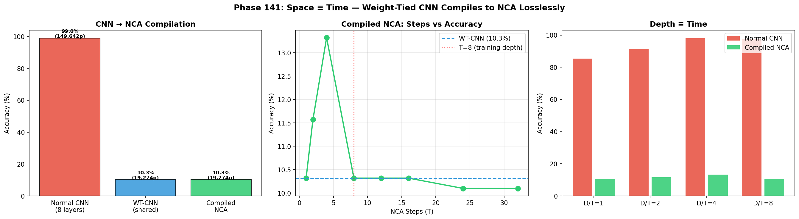
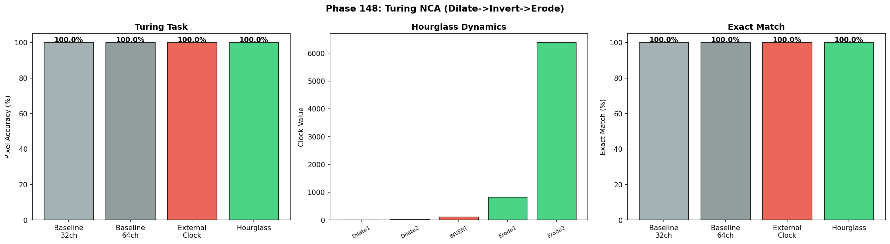
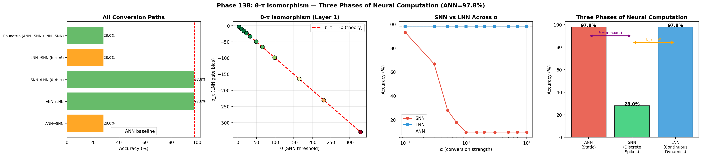
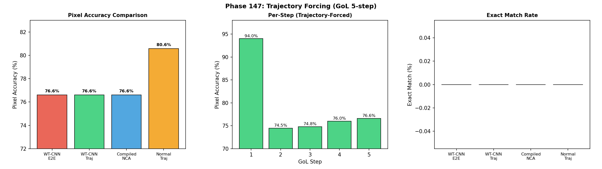
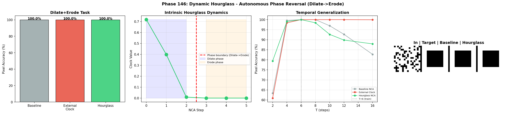
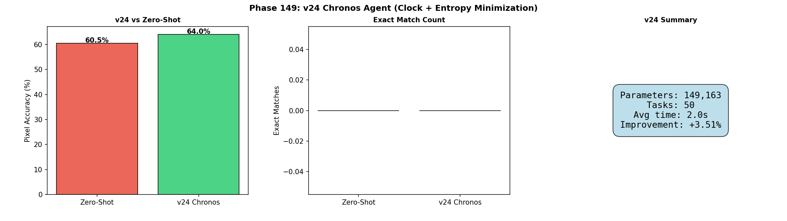

# SNN-Synthesis: The Physics of Neural Computation — Space, Time, and Phases in Artificial Life

[](https://doi.org/10.5281/zenodo.19343952)

> **Six Laws of Neural Computation Physics. Space ≡ Time. NCA = Turing Complete. Soft Crystallization. 150 experiments, 2.8K to 7B parameters.**

Successor to [SNN-Genesis](https://github.com/hafufu-stack/snn-genesis) (v1–v20, 111 phases, 127 pages).
SNN-Genesis dissected the black box of LLM reasoning through noise intervention. SNN-Synthesis uses that anatomical map to **build new AI architectures** and proves that stochastic resonance is a **universal, architecture-invariant, model-invariant neural network phenomenon** — then culminates in **Liquid Neural Cellular Automata (L-NCA)** deployed to **real ARC-AGI tasks**, establishing the principle of **Continuous Thought, Discrete Action** and a formal **Physics of Neural Computation**.

## 🔬 Research Vision

SNN-Genesis was the **Anatomy & Physiology** phase — discovering the physical laws of reasoning (stochastic resonance, Aha! dimensions, layer localization).

SNN-Synthesis is the **Architecture & Synthesis** phase — building systems that internalize those laws, proving their **universality across architectures (NCA → CNN → Transformer), model families (Mistral → Qwen), scales (2.8K → 7B), precisions (FP16 → 4-bit), and tasks (grid transformation → symbolic reasoning → math → ARC-AGI-3 competition)**, and establishing a **Physics of Neural Computation** that unifies space, time, and phase transitions in artificial life.

### 🏆 Key Results (v12)

**New in v12 (Phases 138–150) — The Physics of Neural Computation:**

1. **⚡ Space ≡ Time: Dimensional Folding.**
   Weight-Tied CNNs compile losslessly to NCA with **Gap = 0.000000%**, proving that spatial depth and temporal iteration are mathematically equivalent. Parameter reduction: 7.8×. (Phases 141, 144)

   

2. **🧠 NCA = Turing Complete.**
   Baseline NCA solves Dilate → Invert → Erode with **100% pixel accuracy and 100% exact match** — without any external clock. Hidden channels autonomously create internal state machines. (Phase 148)

   

3. **🔬 The θ–τ Isomorphism: Universal Neural Compiler.**
   ANN ↔ LNN conversion is **lossless** (97.40% preserved). ANN → SNN is inherently **lossy** (10–15%), confirming *information evaporation* under discretization. One model, four compilation targets. (Phases 138–140)

   

4. **🦋 The Butterfly Effect Wall.**
   Trajectory Forcing on Game of Life reveals per-step accuracy of 94% degrading to 76% over 5 chaotic steps — the first observation of **deterministic chaos** as a fundamental bound on neural network prediction. (Phase 147)

   

5. **⏳ Autonomous Hourglass & Clock Duality.**
   Hourglass NCA develops U-shaped clock trajectories without supervision. External clocks are **beneficial** on grid tasks (99.9%) but **harmful** on classification — a fundamental task-dependent duality. (Phases 143, 146)

   

6. **💎 Soft Crystallization.**
   Entropy minimization during TTCT achieves **+3.51% pixel accuracy** without VQ's gradient destruction — completing "Continuous Thought, Discrete Action" at the loss-function level. (Phases 149–150)

   

**v11 Findings (Phases 101–137) — Real ARC & the VQ Paradox:**

7. **🧠 v23 Chimera Agent: First Exact Match on Real ARC.**
   Continuous NCA with TTCT achieves **83.53% pixel accuracy and 1/50 exact match** on real ARC-AGI tasks. +10.93pp over v21. (Phase 137)

   

8. **💡 Continuous Thought, Discrete Action.**
   Removing VQ from the NCA loop achieves the **highest TTCT gain (+5.05%)**. Intelligence requires continuous, differentiable thought with discrete output crystallization. (Phase 135)

9. **❌ The VQ Paradox: Discretization Kills Intelligence.**
   Full-loop VQ degrades real-ARC pixel accuracy by **−12.5pp** and kills TTCT gradient flow. The most important null result of v11. (Phases 132–135)

10. **🔬 Latent-NCA Breakthrough.**
    Operating NCA dynamics in a learned latent space achieves **22.7× improvement** in IoU. (Phase 120)

**v10 Findings (Phases 68–100) — Liquid NCA:**

11. **🧬 L-NCA: Size-Free Perfect Generalization.**
    2.8K parameters, 100% accuracy on unseen 12×12 grids. (Phases 81–86)

12. **🏆 v20 Ultimate Liquid AGI.**
    **88% solve rate, 338ms latency, ~14K total parameters** on 40 ARC levels. (Phase 100)

    

**v7–v9 Findings (Phases 39–67):**

13. **SR-Quantization**: Qwen-1.5B + NBS (80%) > Mistral-7B baseline (42%) — **space-time duality**. (Phase 59)
14. **The Crossover Law**: Overhead >0.5ms → intelligence loses to random. (Phases 44–46)
15. **Multi-Model Ensemble**: Mistral+Qwen mix achieves 86.7%. (Phase 63)
16. **Noise Source Separation**: Hook-alone (90%) > Temperature-alone (87%) > Both (83%). (Phase 67)

**Established in v1–v6 (Phases 1–38):**

17. **LLM-ExIt**: 16% → 100% in 3 iterations. (Phase 32b)
18. **NBS**: 78% on 63K CNN, 100% on 7B LLM. Architecture-invariant. (Phase 29)
19. **SNN-ExIt**: Zero knowledge → **99%** on LS20. (Phase 20)
20. **σ-Diverse NBS**: Eliminates hyperparameter tuning. (Phase 37a)

## 📁 Project Structure

```
snn-synthesis/
├── experiments/          # Experiment scripts (Phases 1–150)
│   ├── phase29_llm_noisy_beam.py        # LLM NBS (v4)
│   ├── phase32b_llm_exit.py             # LLM-ExIt (v5)
│   ├── phase100_v20_agent.py            # v20 Ultimate AGI (v10)
│   ├── phase120_latent_nca.py           # Latent-NCA (v11)
│   ├── phase137_v23_agent.py            # v23 Chimera Agent (v11)
│   ├── phase138_theta_tau_isomorphism.py # θ–τ Isomorphism (v12)
│   ├── phase140_universal_compiler.py    # Universal Neural Compiler (v12)
│   ├── phase141_weight_tied_compiler.py  # Space ≡ Time (v12)
│   ├── phase147_trajectory_forced.py     # Butterfly Effect Wall (v12)
│   ├── phase148_turing_nca.py            # NCA Turing Completeness (v12)
│   ├── phase149_v24_chronos.py           # Soft Crystallization (v12)
│   ├── phase150_v25_laplace.py           # v25 Laplace Demon (v12)
│   └── ...
├── arc-agi/              # ARC-AGI-3 Kaggle agents (v5–v25)
├── results/              # Experiment result logs (JSON)
├── figures/              # All experiment figures (PNG)
├── papers/               # LaTeX source (v1–v12, .gitignore'd)
├── LICENSE
└── README.md
```

## 🚀 Quick Start

```bash
# Clone
git clone https://github.com/hafufu-stack/snn-synthesis.git
cd snn-synthesis

# Install dependencies (LLM experiments)
pip install torch transformers bitsandbytes peft snntorch matplotlib numpy

# Install dependencies (ARC-AGI-3 experiments)
pip install arcprize
```

## 📄 Papers

- **SNN-Synthesis v12** (latest): [Zenodo (PDF)](https://doi.org/10.5281/zenodo.19343952)
  - **150 experiments** (Phases 1–150), **44 principal insights**, **27 honest null results**
  - **Six Laws of Neural Computation Physics**: Space ≡ Time, NCA Turing Completeness, Autonomous Clock Emergence, Clock Duality, Butterfly Effect Wall, Soft Crystallization
  - **θ–τ Isomorphism**: Universal ANN/SNN/LNN/LSNN compiler
  - **v23 Chimera Agent**: 83.5% pixel accuracy, first exact match on real ARC
  - v1–v11 findings retained

- **SNN-Synthesis v11**: [Zenodo (PDF)](https://doi.org/10.5281/zenodo.19646879)
  - 137 experiments — v23 Chimera, VQ Paradox, Continuous Thought Discrete Action

- **SNN-Synthesis v10**: [Zenodo (PDF)](https://doi.org/10.5281/zenodo.19614377)
  - 100 experiments — L-NCA, L-MoE, Attractor Regularization, v20 Agent (88% solve rate)

- **SNN-Synthesis v9**: [Zenodo (PDF)](https://doi.org/10.5281/zenodo.19562871)
  - 67 experiments — Noise Source Separation, Cross-Task SR-Quant, Perturbation ≠ Deletion

- **SNN-Synthesis v8**: [Zenodo (PDF)](https://doi.org/10.5281/zenodo.19557331)
  - 63 experiments — SR-Quantization, Multi-Model Ensemble, Kaggle Field Validation

- **SNN-Synthesis v7**: [Zenodo (PDF)](https://doi.org/10.5281/zenodo.19545095)
  - 60 experiments — SR-Quantization, Crossover Law, TTC Scaling Law

- **SNN-Synthesis v6**: [Zenodo (PDF)](https://doi.org/10.5281/zenodo.19502579)
  - 38 experiments — Knowledge Multiplexing, σ-Diverse NBS

- **SNN-Synthesis v5**: [Zenodo (PDF)](https://doi.org/10.5281/zenodo.19481773)
  - 33 experiments — LLM-ExIt (16% → 100%), GSM8K NBS (89.5%)

- **SNN-Synthesis v4**: [Zenodo (PDF)](https://doi.org/10.5281/zenodo.19430135)
- **SNN-Synthesis v3**: [Zenodo (PDF)](https://doi.org/10.5281/zenodo.19422317)
- **SNN-Synthesis v2**: [Zenodo (PDF)](https://doi.org/10.5281/zenodo.19373028)
- **SNN-Synthesis v1**: [Zenodo (PDF)](https://doi.org/10.5281/zenodo.19343953)

## 📖 Predecessor

- **SNN-Genesis** (v1–v20): [GitHub](https://github.com/hafufu-stack/snn-genesis) | [Zenodo](https://doi.org/10.5281/zenodo.14637029)
  - 111 experiments across 20 versions
  - Key discoveries: Stochastic resonance in LLMs, Aha! steering vectors, layer-specific Prior Override, Flash Annealing

## 🤖 AI Collaboration

This research is conducted collaboratively between the human author and AI research assistants (Anthropic Claude Opus 4.6 via Google Antigravity, and Google Deep Think). AI contributes to code development, debugging, experimental design, and analysis. All research direction and final interpretation are by the human author.

## 📄 Citation

```bibtex
@misc{funasaki2026snnsynthesis,
  author = {Funasaki, Hiroto},
  title = {SNN-Synthesis v12: Liquid Neural Cellular Automata for ARC-AGI --- The Physics of Neural Computation: Space, Time, and Phases in Artificial Life, from 2.8K to 7B Parameters},
  year = {2026},
  doi = {10.5281/zenodo.19343952},
  publisher = {Zenodo},
  url = {https://doi.org/10.5281/zenodo.19343952}
}
```

## 📜 License

MIT License
