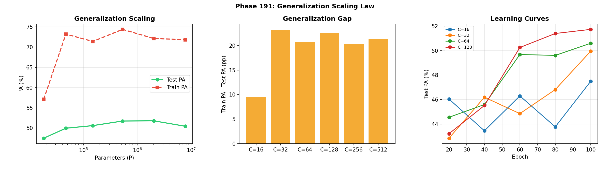
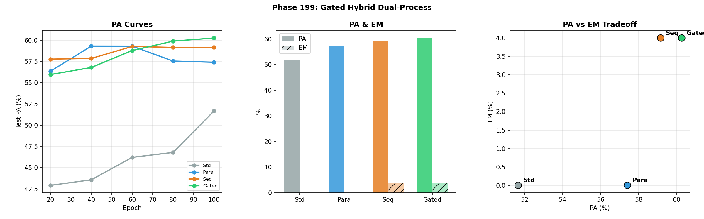

# SNN-Synthesis: The NCA Intelligence Equation — Architecture > Scale in Spatial Reasoning

[](https://doi.org/10.5281/zenodo.19343952)

> **NCA Intelligence Equation. Dual-Process Architecture. Architecture > Scale. 202 experiments, 2.8K to 7B parameters.**

Successor to [SNN-Genesis](https://github.com/hafufu-stack/snn-genesis) (v1–v20, 111 phases, 127 pages).
SNN-Genesis dissected the black box of LLM reasoning through noise intervention. SNN-Synthesis uses that anatomical map to **build new AI architectures** and proves that stochastic resonance is a **universal, architecture-invariant, model-invariant neural network phenomenon** — then culminates in **Liquid Neural Cellular Automata (L-NCA)** deployed to **real ARC-AGI tasks**, establishes a formal **Physics of Neural Computation**, discovers the **15 Laws of Digital Life**, and proves that **architecture dominates scale** for spatial reasoning via the **NCA Intelligence Equation** and the **Gated Hybrid Dual-Process NCA**.

## 🔬 Research Vision

SNN-Genesis was the **Anatomy & Physiology** phase — discovering the physical laws of reasoning (stochastic resonance, Aha! dimensions, layer localization).

SNN-Synthesis is the **Architecture & Synthesis & Life & Intelligence** phase — building systems that internalize those laws, proving their **universality across architectures (NCA → CNN → Transformer), model families (Mistral → Qwen), scales (2.8K → 7B), precisions (FP16 → 4-bit), and tasks (grid transformation → symbolic reasoning → math → ARC-AGI → artificial life)**, establishing a **Physics of Neural Computation**, the **15 Laws of Digital Life**, and culminating in the **NCA Intelligence Equation** — proving that architectural hierarchy, not parameter scaling, is the path to spatial intelligence.

### 🧠 Key Results (v14) — The NCA Intelligence Equation & Dual-Process Architecture

**New in v14 (Phases 174–202) — Architecture > Scale:**

1. **📐 The NCA Intelligence Equation.**
   Memory scales super-linearly as **M ∝ P^1.33** (exceeding Transformer P^1.0), but generalization saturates at **G ∝ P^0.01** — the *Generalization Wall*. Computation time **destroys** memory (T=1 optimal). Parameter scaling cannot produce spatial reasoning. (Phases 188–193)

   

2. **🧬 Gated Hybrid Dual-Process NCA: PA=60.3%, EM=4.0% — All-Time Best.**
   A learned per-pixel gate fuses System 1 (intuition, T=1) with System 2 (reasoning, T=10). Gate converges to g≈1.0: the model trusts fast intuition for 99% of pixels, invoking slow logic only for disputed edge cases. (Phase 199)

   

3. **🚧 The Locality Wall: LLM Techniques Fail in NCA.**
   Self-Attention (+0.4pp), Working Memory (−2.2pp), Spatial Pyramids (+0.3pp), and Dilated Convolutions (−1.4pp) all fail. Global communication destroys the spatial coordinate system essential for ARC geometric reasoning. (Phases 195–198)

4. **⏪ Time-Travel NCA: +2.3pp via Temporal Rewinding.**
   Running T=20 steps and rewinding to the highest-confidence step (t*=3) prevents drift-induced memory collapse. Confirms the Time–Memory Antagonism. (Phase 201)

5. **😴 Metabolic Sleep: +6.2pp Anti-Drift Protection.**
   Freezing high-confidence pixels during GA inference prevents drift-induced corruption. Sleep is not energy conservation — it is memory preservation. (Phase 177)

### 🧬 v13 Findings (Phases 151–173) — The 15 Laws of Digital Life

6. **🧬 Thermodynamic Autopoiesis: Self-Sustaining Digital Life.**
   NCA cells consuming a diffusing nutrient field self-organize into sustained life (Variance=2,634) **without any global loss function or target image**. (Phase 171)

   

7. **🦎 Evolution > Backpropagation.**
   GA achieves **100% accuracy** where Backprop scores **0%** on AND-gate NCA tasks. (Phase 163)

   

8. **🏆 Darwin > Lamarck: First Exact Match via Evolution.**
   Pure GA (PA=69.5%, **EM=2.5%**) outperforms Lamarckian GA+Backprop (PA=64.8%, EM=0%) on real ARC. (Phase 172)

9. **🔬 Foundation-Seeded GA-TTCT: +10pp over Backprop.**
   GA-based task embedding optimization achieves PA=65.0% vs. Backprop TTCT 55.0%. (Phase 169)

### 🔭 v12 Findings (Phases 138–150) — The Physics of Neural Computation

10. **⚡ Space ≡ Time: Dimensional Folding.**
    Weight-Tied CNNs compile losslessly to NCA with **Gap = 0.000000%**. (Phases 141, 144)

11. **🧠 NCA = Turing Complete.**
    Baseline NCA solves Dilate → Invert → Erode with **100% exact match**. (Phase 148)

12. **🔬 The θ–τ Isomorphism: Universal Neural Compiler.**
    ANN ↔ LNN conversion is **lossless** (97.40%). ANN → SNN is inherently **lossy** (10–15%). (Phases 138–140)

### 🎯 v11 Findings (Phases 101–137) — Real ARC & the VQ Paradox

13. **🧠 v23 Chimera Agent: First Exact Match on Real ARC.**
    Continuous NCA with TTCT: **83.53% pixel accuracy, 1/50 exact match**. (Phase 137)

14. **💡 Continuous Thought, Discrete Action.**
    Removing VQ from NCA achieves the **highest TTCT gain (+5.05%)**. (Phase 135)

### 🧪 v1–v10 Foundations (Phases 1–100)

15. **🧬 L-NCA: Size-Free Perfect Generalization.** 2.8K params, 100% accuracy on unseen grids. (Phases 81–86)
16. **🏆 v20 Ultimate Liquid AGI.** 88% solve rate, 338ms latency, ~14K params. (Phase 100)
17. **SR-Quantization**: Qwen-1.5B + NBS (80%) > Mistral-7B baseline (42%). (Phase 59)
18. **LLM-ExIt**: 16% → 100% in 3 iterations. (Phase 32b)
19. **NBS**: Architecture-invariant stochastic resonance. (Phase 29)
20. **SNN-ExIt**: Zero knowledge → 99% on LS20. (Phase 20)

## 📁 Project Structure

```
snn-synthesis/
├── experiments/          # Experiment scripts (Phases 1–202)
│   ├── phase100_v20_agent.py            # v20 Ultimate AGI (v10)
│   ├── phase137_v23_agent.py            # v23 Chimera Agent (v11)
│   ├── phase148_turing_nca.py           # NCA Turing Completeness (v12)
│   ├── phase171_autopoiesis.py          # Thermodynamic Autopoiesis (v13)
│   ├── phase188_capacity.py             # NCA Memory Capacity Law (v14)
│   ├── phase191_generalization.py       # Generalization Wall (v14)
│   ├── phase192_dual_process.py         # Dual-Process NCA (v14)
│   ├── phase199_gated.py               # Gated Hybrid (v14)
│   ├── phase201_timetravel.py           # Time-Travel NCA (v14)
│   └── ...
├── arc-agi/              # ARC-AGI-3 Kaggle agents (v5–v27)
├── results/              # Experiment result logs (JSON)
├── figures/              # All experiment figures (PNG)
├── papers/               # LaTeX source (.gitignore'd)
├── LICENSE
└── README.md
```

## 🚀 Quick Start

```bash
# Clone
git clone https://github.com/hafufu-stack/snn-synthesis.git
cd snn-synthesis

# Install dependencies (LLM experiments)
pip install torch transformers bitsandbytes peft snntorch matplotlib numpy

# Install dependencies (ARC-AGI-3 experiments)
pip install arcprize
```

## 📄 Papers

- **SNN-Synthesis v14** (latest): [Zenodo (PDF)](https://doi.org/10.5281/zenodo.19343952)
  - **202 experiments** (Phases 1–202), **73 principal insights**, **27+ honest null results**
  - **NCA Intelligence Equation**: M ∝ P^1.33 (memory), G ∝ P^0.01 (generalization)
  - **Gated Hybrid Dual-Process**: PA=60.3%, EM=4.0% — project's all-time best
  - **Locality Wall**: Self-Attention, Working Memory, Pyramids, Dilated Conv all fail
  - **Time-Travel NCA**: +2.3pp via temporal rewinding to t*=3
  - v1–v13 findings retained

- **SNN-Synthesis v13**: [Zenodo (PDF)](https://doi.org/10.5281/zenodo.19343952)
  - 173 experiments — 15 Laws of Digital Life, Evolution > Backpropagation, Autopoiesis

- **SNN-Synthesis v12**: [Zenodo (PDF)](https://doi.org/10.5281/zenodo.19646879)
  - 150 experiments — Six Laws of Neural Computation Physics, θ–τ Isomorphism, Space ≡ Time

- **SNN-Synthesis v11**: [Zenodo (PDF)](https://doi.org/10.5281/zenodo.19646879)
  - 137 experiments — v23 Chimera, VQ Paradox, Continuous Thought Discrete Action

- **SNN-Synthesis v10**: [Zenodo (PDF)](https://doi.org/10.5281/zenodo.19614377)
  - 100 experiments — L-NCA, L-MoE, v20 Agent (88% solve rate)

- **SNN-Synthesis v9**: [Zenodo (PDF)](https://doi.org/10.5281/zenodo.19562871)
- **SNN-Synthesis v8**: [Zenodo (PDF)](https://doi.org/10.5281/zenodo.19557331)
- **SNN-Synthesis v7**: [Zenodo (PDF)](https://doi.org/10.5281/zenodo.19545095)
- **SNN-Synthesis v6**: [Zenodo (PDF)](https://doi.org/10.5281/zenodo.19502579)
- **SNN-Synthesis v5**: [Zenodo (PDF)](https://doi.org/10.5281/zenodo.19481773)
- **SNN-Synthesis v4**: [Zenodo (PDF)](https://doi.org/10.5281/zenodo.19430135)
- **SNN-Synthesis v3**: [Zenodo (PDF)](https://doi.org/10.5281/zenodo.19422317)
- **SNN-Synthesis v2**: [Zenodo (PDF)](https://doi.org/10.5281/zenodo.19373028)
- **SNN-Synthesis v1**: [Zenodo (PDF)](https://doi.org/10.5281/zenodo.19343953)

## 📖 Predecessor

- **SNN-Genesis** (v1–v20): [GitHub](https://github.com/hafufu-stack/snn-genesis) | [Zenodo](https://doi.org/10.5281/zenodo.14637029)
  - 111 experiments across 20 versions
  - Key discoveries: Stochastic resonance in LLMs, Aha! steering vectors, layer-specific Prior Override, Flash Annealing

## 🤖 AI Collaboration

This research is conducted collaboratively between the human author and AI research assistants (Anthropic Claude Opus 4.6 via Google Antigravity, and Google Deep Think). AI contributes to code development, debugging, experimental design, and analysis. All research direction and final interpretation are by the human author.

## 📄 Citation

```bibtex
@misc{funasaki2026snnsynthesis,
  author = {Funasaki, Hiroto},
  title = {SNN-Synthesis v14: Liquid Neural Cellular Automata for ARC-AGI --- From Stochastic Resonance to The NCA Intelligence Equation and Dual-Process Architecture: Architecture > Scale in Spatial Reasoning from 2.8K to 7B Parameters},
  year = {2026},
  doi = {10.5281/zenodo.19343952},
  publisher = {Zenodo},
  url = {https://doi.org/10.5281/zenodo.19343952}
}
```

## 📜 License

MIT License
