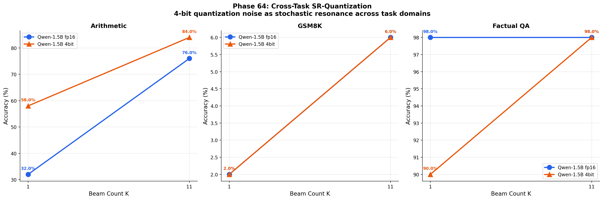
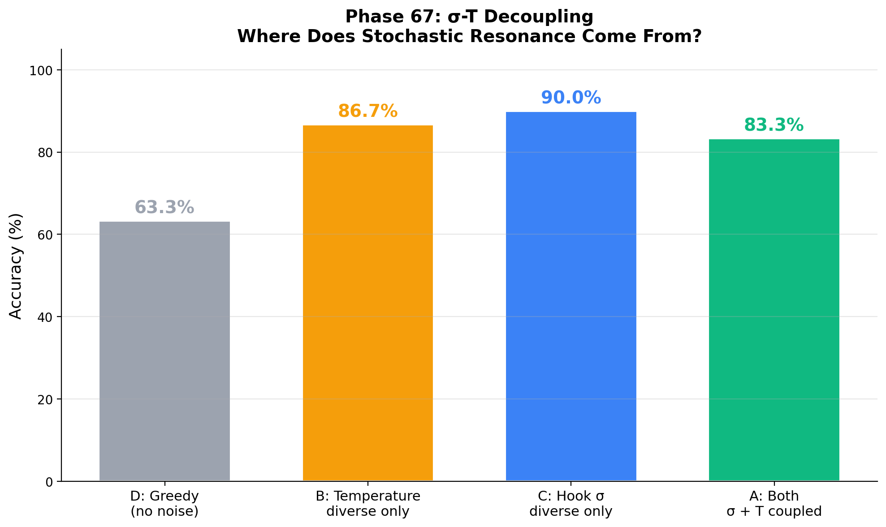
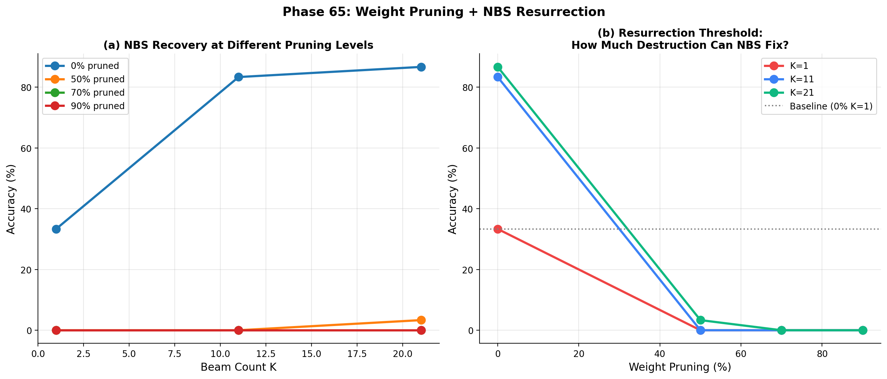
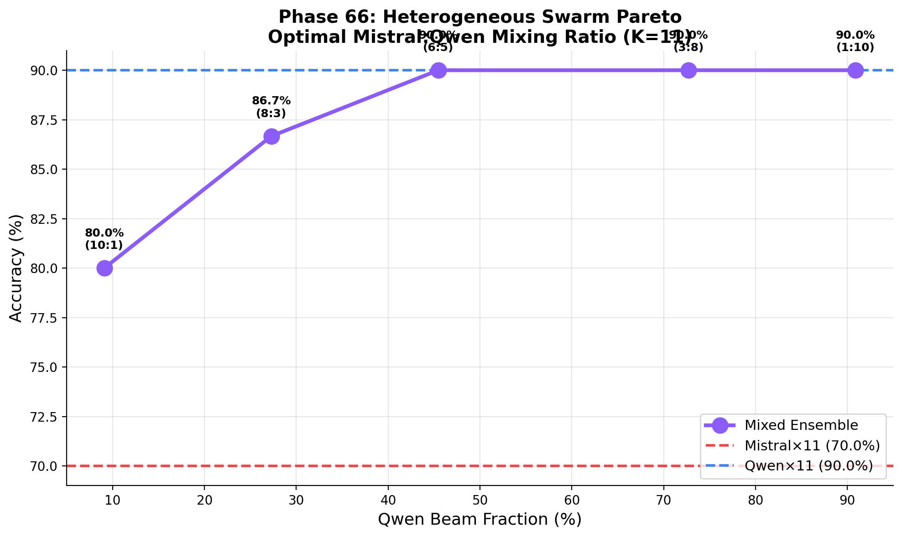
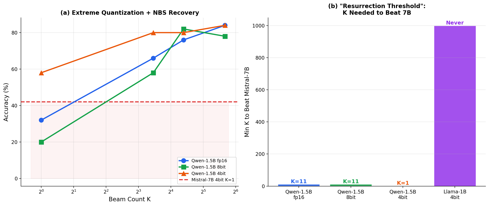
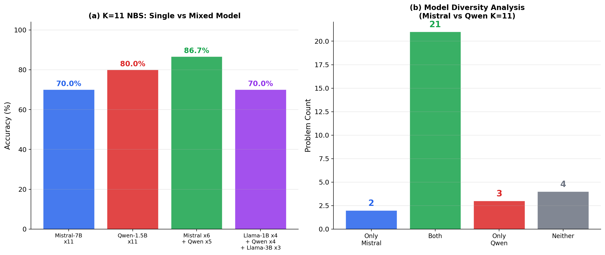
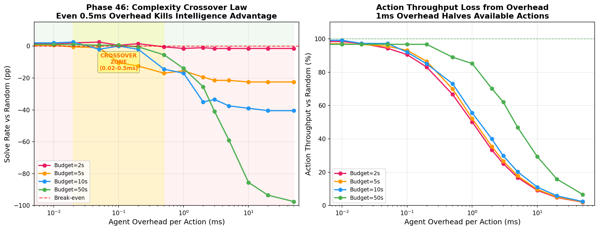

# SNN-Synthesis: Noise Source Separation, Cross-Task Validation, and the Irreversibility of Spatial Destruction

[](https://doi.org/10.5281/zenodo.19343952)

> **Small + Noise > Large + Greedy — Stochastic resonance is architecture-invariant, model-invariant, scale-invariant, quantization-robust, API-deployable, and can compensate for lost parameters**

Successor to [SNN-Genesis](https://github.com/hafufu-stack/snn-genesis) (v1–v20, 111 phases, 127 pages).
SNN-Genesis dissected the black box of LLM reasoning through noise intervention. SNN-Synthesis uses that anatomical map to **build new AI architectures** and proves that stochastic resonance is a **universal, architecture-invariant, model-invariant neural network phenomenon**—then harnesses it for **autonomous self-evolution without any human supervision**.

## 🔬 Research Vision

SNN-Genesis was the **Anatomy & Physiology** phase — discovering the physical laws of reasoning (stochastic resonance, Aha! dimensions, layer localization).

SNN-Synthesis is the **Architecture & Synthesis** phase — building systems that internalize those laws, proving their **universality across architectures (CNN → Transformer), model families (Mistral → Qwen), scales (63K → 7B), precisions (FP16 → 4-bit), and tasks (grid navigation → symbolic reasoning → math → factual QA → ARC-AGI-3 competition)**, and demonstrating that noise + natural selection form a **complete learning paradigm**.

### 🏆 Key Results (v9)

**New in v9 (Phases 64–67) — Four New Findings:**

1. **🔬 Cross-Task SR-Quantization: The Space-Time-Precision Triad Generalizes.**
   On arithmetic, 4-bit Qwen-1.5B achieves **58% at K=1**, surpassing FP16 (32%) by +26pp. At K=11, 4-bit (84%) > FP16 (76%). SR-Quantization requires **intermediate baseline competence** — fails on GSM8K (floor: 2%) and Factual QA (ceiling: 98%). (Phase 64)

   

2. **🧪 Noise Source Separation: Hook Noise > Temperature Noise > Both Combined.**
   Decoupling weight-space perturbation from sampling-temperature reveals: **hook-alone (90.0%) > temperature-alone (86.7%) > both combined (83.3%) > greedy (63.3%)**. Combining noise sources produces **destructive interference**. Temperature-diverse beam search enables **API-only SR (+23pp)** without model access. (Phase 67)

   

3. **💀 The Irreversibility of Spatial Destruction: Perturbation ≠ Deletion.**
   Weight pruning at 50% → near-total collapse (K=21: 3.3%). At ≥70%, even K=21 NBS yields 0%. Quantization **perturbs** weights → SR. Pruning **deletes** information → irreversible destruction. NBS cannot resurrect erased knowledge. (Phase 65)

   

4. **⚖️ Ensemble Ratio Law: Diversity Premium is Task-Dependent.**
   Sweeping Mistral:Qwen ratio reveals accuracy saturates at ≥6:5 Qwen allocation (90.0%). When one model dominates, adding the weaker model **dilutes** rather than **diversifies**. (Phase 66)

   

**v8 Findings (Phases 61–63 + ARC-AGI-3 Kaggle):**

5. **🔥 Quantization Noise IS Stochastic Resonance.**
   4-bit Qwen-1.5B achieves **58% at K=1 without beam search**, surpassing both FP16 (32%) and Mistral-7B baseline (42%). The space-time duality extends to a **space-time-precision triad**. (Phase 61)

   

6. **🧬 Multi-Model Beam Ensemble: Architectural Diversity is Orthogonal to Noise Diversity.**
   Mixing beams from Mistral-7B (×6) + Qwen-1.5B (×5) achieves **86.7%**, surpassing all single-model ensembles by +6.7–16.7pp. (Phase 63)

   

7. **🏟️ ARC-AGI-3 Kaggle Field Validation: Thermodynamic Coarse-Graining.**
   Five agents submitted to live competition. The simplest (v5: macro-stats UCB, **score 0.13**) beats all "intelligent" agents (v14 CfC: 0.10, v12 LLM: 0.07, v13 SimHash: 0.02). The winning strategy uses **thermodynamic coarse-graining**.

**v7 Landmark Results (Phases 39–60):**

8. **Stochastic Resonance Quantization**: Qwen-1.5B + NBS (80%) > Mistral-7B baseline (42%) — **space-time duality**. (Phase 59)
9. **The Crossover Law** (Bitter Lesson): Overhead >0.5ms → intelligence loses to random exploration. (Phases 44–46)
10. **Test-Time Compute Scaling Law**: Logarithmic accuracy scaling with K, with **non-monotonic saturation** at K=51. (Phases 60, 62)
11. **SimHash O(1) curiosity** matches RND at ~100× less overhead. (Phase 51)
12. **6 null results** (Phases 53–58) confirm design convergence.

   

**Established in v1–v6 (Phases 1–38):**

13. **LLM-ExIt achieves Oracle-free self-evolution.** 16% → 100% in 3 iterations. (Phase 32b)
14. **NBS generalizes to math reasoning.** GSM8K 53% → **89.5%** at K=11. (Phase 31b)
15. **NBS is architecture-invariant.** K=11: 78% on 63K CNN, 100% on 7B LLM. (Phase 29)
16. **SNN-ExIt:** Zero knowledge → **99%** on LS20, surpassing Oracle CNN by 21pp. (Phase 20)
17. **Knowledge Multiplexing via Discrete ID Gating.** (Phase 35c)
18. **σ-Diverse NBS eliminates hyperparameter tuning.** (Phase 37a)
19. **NBS is model-invariant.** Qwen2.5-7B matches Mistral-7B. (Phase 38)
20. **25 principal insights, 22 honest null results** across 67 experimental phases.

## 📁 Project Structure

```
snn-synthesis/
├── experiments/          # LLM experiment scripts (Phases 1-7, 3b, 6b, 29-67)
│   ├── phase29_llm_noisy_beam.py        # LLM NBS (v4)
│   ├── phase32b_llm_exit.py             # LLM-ExIt (v5)
│   ├── phase39_curiosity_rnd.py         # RND curiosity (v7)
│   ├── phase44_complexity_budget.py     # Crossover Law (v7)
│   ├── phase51_simhash_curiosity.py     # SimHash O(1) (v7)
│   ├── phase59_sr_quantization.py       # SR-Quantization (v7)
│   ├── phase61_extreme_quantization.py  # Extreme SR-Quant (v8)
│   ├── phase62_spacetime_surface.py     # Space-Time Surface (v8)
│   ├── phase63_multi_model_ensemble.py  # Multi-Model NBS (v8)
│   ├── phase64_cross_task_sr_quant.py   # Cross-Task SR-Quant (v9)
│   ├── phase65_weight_pruning.py        # Weight Pruning (v9)
│   ├── phase66_ensemble_ratio.py        # Ensemble Ratio (v9)
│   ├── phase67_sigma_t_decoupling.py    # σ-T Decoupling (v9)
│   └── ...
├── arc-agi/              # ARC-AGI-3 experiments + Kaggle agents
│   ├── kaggle_cell2_agent_v16.py   # v16 Liquid Minimalist
│   ├── kaggle_cell2_agent_v15.py   # v15 Thermodynamic Explorer
│   ├── kaggle_cell2_agent_v14.py   # v14 CfC + Spatial Features
│   ├── kaggle_cell2_agent_v13.py   # v13 SimHash+σ-diverse NBS
│   ├── kaggle_cell2_agent_llm.py   # v12 LLM+NBS agent
│   └── ...
├── results/              # Experiment result logs (JSON)
├── figures/              # All experiment figures (PNG)
├── papers/               # LaTeX source (v1–v9, .gitignore'd)
├── LICENSE
└── README.md
```

## 🚀 Quick Start

```bash
# Clone
git clone https://github.com/hafufu-stack/snn-synthesis.git
cd snn-synthesis

# Install dependencies (LLM experiments)
pip install torch transformers bitsandbytes peft snntorch matplotlib numpy

# Install dependencies (ARC-AGI-3 experiments)
pip install arcprize
```

## 📄 Papers

- **SNN-Synthesis v9** (latest): [Zenodo (PDF)](https://doi.org/10.5281/zenodo.19343952)
  - **67 experiments** (Phases 1–67), **42 contributions**, **25 principal insights**
  - **Cross-Task SR-Quant**: 4-bit arithmetic +26pp over FP16 (Phase 64)
  - **Noise Source Separation**: Hook (90%) > Temp (87%) > Both (83%) (Phase 67)
  - **Perturbation ≠ Deletion**: Pruning is irreversible; quantization is SR (Phase 65)
  - **Ensemble Ratio Law**: Diversity premium is task-dependent (Phase 66)
  - **22 honest null results** confirming design convergence
  - v1–v8 findings retained

- **SNN-Synthesis v8**: [Zenodo (PDF)](https://doi.org/10.5281/zenodo.19557331)
  - 63 experiments — SR-Quantization, Multi-Model Ensemble, Kaggle Field Validation

- **SNN-Synthesis v7**: [Zenodo (PDF)](https://doi.org/10.5281/zenodo.19545095)
  - 60 experiments — SR-Quantization, Crossover Law, TTC Scaling Law

- **SNN-Synthesis v6**: [Zenodo (PDF)](https://doi.org/10.5281/zenodo.19502579)
  - 38 experiments — Knowledge Multiplexing, σ-Diverse NBS, Multi-Model Universality

- **SNN-Synthesis v5**: [Zenodo (PDF)](https://doi.org/10.5281/zenodo.19481773)
  - 33 experiments — LLM-ExIt (16% → 100%), GSM8K NBS (89.5%)

- **SNN-Synthesis v4**: [Zenodo (PDF)](https://doi.org/10.5281/zenodo.19430135)
  - 30 experiments — LLM NBS achieves 100% at K=11

- **SNN-Synthesis v3**: [Zenodo (PDF)](https://doi.org/10.5281/zenodo.19422317)
  - Noisy Beam Search (78% L2), SNN-ExIt (99% LS20)

- **SNN-Synthesis v2**: [Zenodo (PDF)](https://doi.org/10.5281/zenodo.19373028)
- **SNN-Synthesis v1**: [Zenodo (PDF)](https://doi.org/10.5281/zenodo.19343953)

## 📖 Predecessor

- **SNN-Genesis** (v1–v20): [GitHub](https://github.com/hafufu-stack/snn-genesis) | [Zenodo](https://doi.org/10.5281/zenodo.14637029)
  - 111 experiments across 20 versions
  - Key discoveries: Stochastic resonance in LLMs, Aha! steering vectors, layer-specific Prior Override (L16=76.7%), Trajectory Distillation (48%), SNN adaptive control

## 🤖 AI Collaboration

This research is conducted collaboratively between the human author and AI research assistants (Anthropic Claude Opus 4.6 via Google Antigravity, and Google Deep Think). AI contributes to code development, debugging, experimental design, and analysis. All research direction and final interpretation are by the human author.

## 📄 Citation

```bibtex
@misc{funasaki2026snnsynthesis,
  author = {Funasaki, Hiroto},
  title = {SNN-Synthesis v9: Noise Source Separation, Cross-Task Validation, and the Irreversibility of Spatial Destruction from 63K to 7B Parameters},
  year = {2026},
  doi = {10.5281/zenodo.19343952},
  publisher = {Zenodo},
  url = {https://doi.org/10.5281/zenodo.19343952}
}
```

## 📜 License

MIT License
